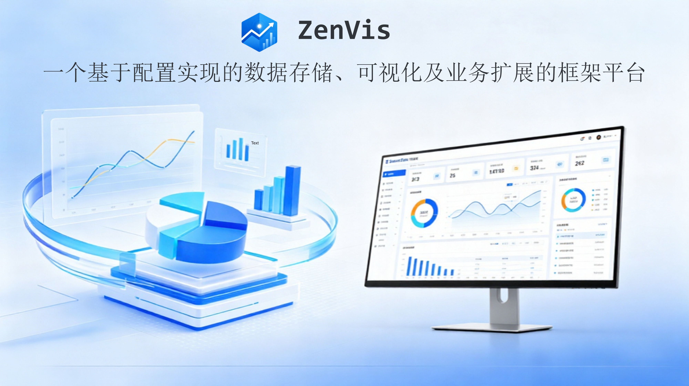

# ZenVis



ZenVis 是一个面向企业数据分析场景的配置化应用框架，将数据接入、元数据管理、统一检索、可视化、插件扩展和 AI 智能分析组织在同一平台中。业务团队可以通过配置和插件快速建立数据模型、接入数据、构建应用，并复用平台提供的权限、检索、看板和智能分析能力。

## 项目组成

| 目录 | 作用 | 技术栈 |
| --- | --- | --- |
| `zenvis-backend` | 平台 API、系统管理、检索、插件生命周期、DIH 与业务服务管理 | Java 17、Spring Boot 3.2.0、Spring AI 1.1.0-M4 |
| `zenvis-frontend` | 管理控制台、检索、看板、低代码页面与 DIH 工作台 | Vue 3.5、TypeScript 6、Vite 8、Element Plus 2.14 |
| `zenvis-plugin` | 可安装插件、插件 API 扩展与打包工具 | JSON/YAML、Java、HTML、tar.gz |
| `zenvis-plugin-community` | 社区与客户场景插件集合 | JSON/YAML、Java、AMIS、HTML |
| `zenvis-business-service-spring-boot-starter` | 业务应用服务心跳和事件上报组件 | Spring Boot 3.x、Java 17 |
| `zenvis-business-service-golang` | 业务应用服务心跳和事件上报 SDK | Go 1.22+、标准库 |
| `agent-skills` | ZenVis 插件创建与校验技能 | Codex Skill |

各子项目保留自己的 `README.md`，用于独立构建和维护。跨模块的产品、架构、部署、使用与开发说明统一维护在根目录的 [ZenVis 文档中心](doc/README.md)。

## 快速开始

### 在线快速部署

脚本会自动检查 Docker 与 Docker Compose、按需拉取项目、匹配 `amd64`/`arm64` 镜像，并在全部容器健康且 Web 页面可访问后输出登录信息：

```bash
curl -fsSL https://gitee.com/coolxer-studio/zenvis/raw/feature/1.0.0.alpha/quick-deploy.sh | bash
```

在已拉取的项目根目录中也可以直接执行：

```bash
chmod +x quick-deploy.sh
./quick-deploy.sh
```

### Docker Compose

完整环境由项目根目录的 `deploy` 目录统一编排：

```bash
cd zenvis
./zenvisctl compose init
./zenvisctl compose doctor
./zenvisctl compose up
```

默认服务入口：

| 服务 | 地址 |
| --- | --- |
| ZenVis Web | `http://localhost:11000` |
| ZenVis API / Swagger | `http://localhost:11001`、`http://localhost:11001/swagger-ui/index.html` |
| Vectum 数据服务 | `http://localhost:11002` |

初始化命令会为数据库、API、MCP、Vectum 和两个内置账号生成独立随机凭据。首次登录后应修改账号密码；完整说明见[快速开始](doc/02-安装部署与升级/快速开始.md)。Kubernetes 环境使用仓库内的 [Helm Chart 部署指南](doc/02-安装部署与升级/Kubernetes部署.md)。

### 本地开发

后端：

先按[后端开发指南](doc/07-开发指南/zenvis-backend-开发对接指南.md)准备本地基础设施和 `config/local-secrets.properties`，再运行：

```bash
cd zenvis-backend
mvn test
mvn spring-boot:run
```

前端：

```bash
cd zenvis-frontend
yarn install
yarn server:dev
```

前端开发服务器位于 `http://localhost:8090`，默认将 `/zenvis` 请求代理到 `http://localhost:11001`。详细步骤见[安装部署与升级](doc/02-安装部署与升级/README.md)。

## 核心能力

- 通过 Meta 配置定义实体、属性、操作符和 ClickHouse 存储结构。
- 通过 Vector 服务、Kafka 和插件推送任务接入外部数据。
- 通过全局检索完成筛选、排序、聚合、趋势分析和过滤器复用。
- 通过内置、低代码、HTML 与外链四类看板组织可视化应用。
- 通过插件安装 Meta、推送任务、动态 API、UI、看板、MCP、Skill 和菜单。
- 通过 DIH 提供知识问答、数据接入、数据可视化、专项 Skill、报表和后台 AI 分析任务。
- 通过 Spring Boot Starter 或 Go SDK 采集业务应用实例心跳和事件。
- 通过社区插件仓库和插件创建 Skill 复用行业接入实现与代码一致性校验流程。

## 文档

| 主题 | 文档 |
| --- | --- |
| 产品与使用 | [产品理念与使用](doc/01-产品理念与使用/README.md) |
| 启动与部署 | [安装部署与升级](doc/02-安装部署与升级/README.md) |
| 插件扩展 | [插件开发与集成](doc/03-插件开发与集成/README.md) |
| AI 能力 | [AI 与数据智能](doc/04-AI与数据智能/README.md) |
| 应用接入 | [业务服务接入](doc/05-业务服务接入/README.md) |
| 技术设计 | [架构设计](doc/06-架构设计/README.md) |
| 工程协作 | [开发指南](doc/07-开发指南/README.md) |
| 接口对接 | [API 参考](doc/08-API参考/README.md) |

## 许可证与联系

项目采用 [Apache License 2.0](LICENSE)。问题与建议可通过项目 Issue 或 <coolxer@163.com> 反馈。
