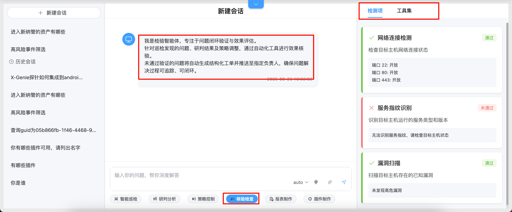
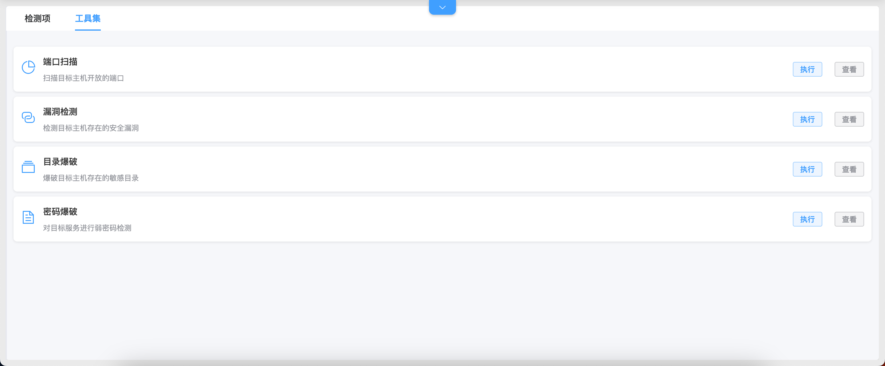
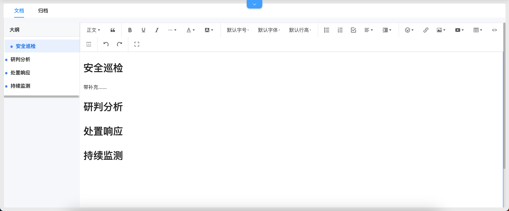
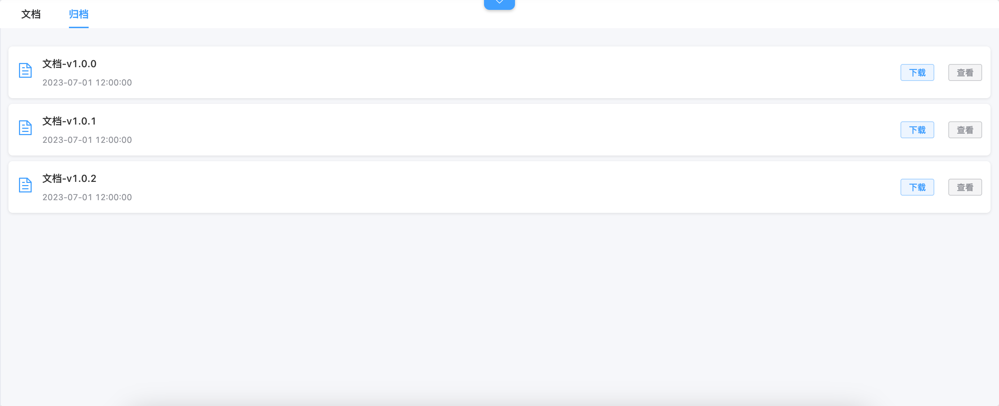
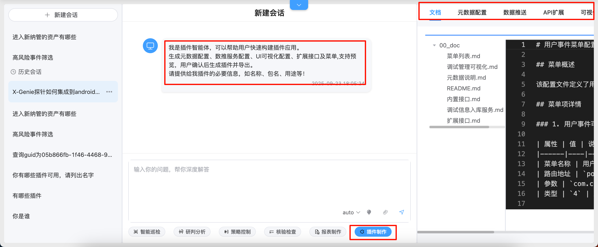
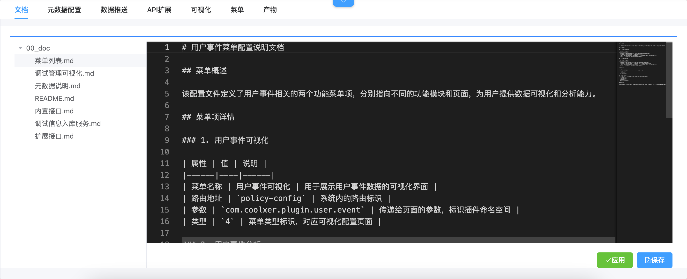
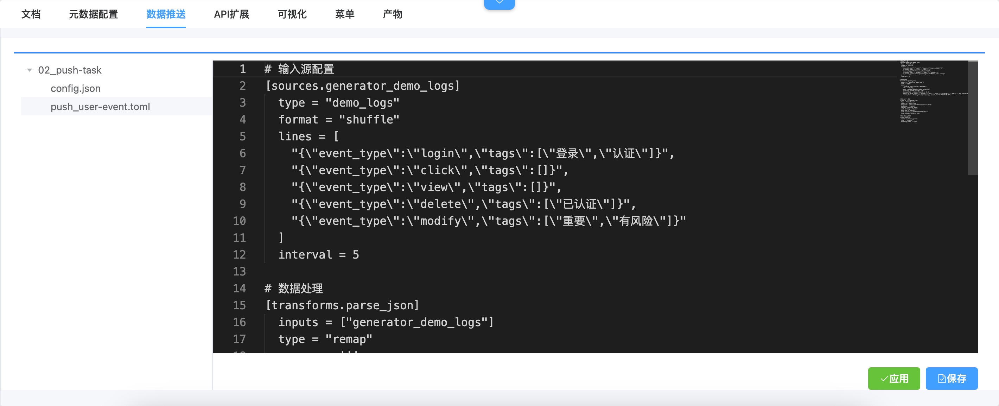

# 数智中心

> 数智中心是依托AI大模型技术，融合检测分析业务知识经过优化训练后实现自动化值守的系统。  
> 该系统利用先进的人工智能技术和机器学习算法，对平台采集的海量数据进行深度分析和智能处理，为用户提供全方位的智能化服务。

## 核心价值

- **智能化服务**：基于AI大模型实现自然语言交互，降低用户使用门槛
- **自动化处理**：从数据查询到风险处置全流程自动化，减少人工干预
- **决策支持**：通过数据分析和模型预测，为业务决策提供科学依据
- **效率提升**：自动化生成报表、插件等，大幅提升工作效率

## 技术优势

- **AI大模型驱动**：采用先进的大语言模型技术，具备强大的理解和生成能力
- **业务知识融合**：深度融合检测分析业务知识，提供专业级智能服务
- **全流程覆盖**：涵盖数据查询、分析、策略制定、执行验证等完整流程
- **持续学习优化**：系统具备自我学习和优化能力，不断提升服务质量

## 适用场景

- **智能运维**：自动处理日常运维任务，降低人力成本
- **风险识别**：智能识别潜在风险并提供后续建议
- **指标分析**：自动生成数据分析报告，辅助管理决策
- **知识管理**：基于知识库提供智能问答服务

# 知识问答

以当前系统导入的知识库为基础，通过自然语言交互模式回答用户问题。系统能够理解用户意图，从海量知识数据中快速检索相关信息，并以易于理解的方式呈现给用户。

## 核心能力

- **自然语言理解**：支持多种问法和表达方式，准确理解用户需求
- **知识检索**：基于语义检索技术，快速定位相关知识点
- **智能回答**：将检索到的信息组织成易于理解的答案
- **上下文关联**：支持多轮对话，保持上下文连贯性

## 应用场景

- 系统使用咨询
- 技术问题解答
- 业务流程查询
- 配置参数说明

*图1：知识问答功能界面，用户可通过自然语言与系统交互，获取相关业务知识和系统使用帮助*

# 数据接入智能体

数据接入智能体用于生成或更新 Meta 配置，并可继续创建 PushTask/Vectum 数据推送服务。
普通请求由服务端工作流控制，候选配置在用户确认后锁定；配置写入、任务创建、读回和日志
验证都必须有真实 MCP 调用证据。

## 普通请求

- **Meta 配置**：信息收集后先检查配置树，展示候选配置；用户选择“添加配置到系统”后，
  新文件依次经过 `config_add`、`config_apply` 的 MCP 审批，最后使用 `config_read`
  校验写入内容。
- **数据推送**：先确认完整 PushTask 配置，再检测格式、检查 `sourceMark` 冲突、创建或
  复用任务，并读取任务状态和 system 日志。
- **失败处理**：审批拒绝、配置读回不一致、任务不唯一、运行状态异常或本轮日志存在错误时，
  不显示成功记录；界面会保留失败阶段和可重试入口。

业务卡上的“添加配置到系统”是进入写入流程的确认，不等于批准所有 MCP 操作。每个高风险
工具仍会单独展示审批卡。

## 无模型演示

开场白中的用户事件数据接入示例使用确定性演示流程，即使没有配置大模型也能运行。
示例仍会真实调用配置和数据推送 MCP；写操作必须逐次选择“允许本次”或“拒绝执行”。

# 数据可视化

数据可视化智能体用于查询真实 Meta 和实体数据，生成临时图表、单页面应用、带侧边栏应用、
数据看板和菜单。用户只需要描述分析目标，不需要提供 SQL、物理表名或物理列名。

## 核心功能

- **真实 Meta 选择**：平台先调用 MCP 查询实体，再根据用户选择查询该实体的字段。
- **严格候选**：实体和字段只能从 MCP 返回选项中选择，不能自由输入或使用 Agent 编造值。
- **查询方案确认**：查询前展示实体、字段角色、指标、维度、过滤条件、统计口径、目标工具和参数。
- **通用图表查询**：支持指标卡、趋势、TopN、多维聚合、热力图、直方图、散点图、气泡图、
  明细表和关系图。
- **真实 ECharts 渲染**：查询成功后直接使用接口返回的纯 JSON `echarts.option` 渲染。
- **受控落地**：配置、看板和菜单写入都需要 MCP 审批，并在创建后读回验证。

## 使用流程

1. 描述需要分析的业务问题和期望图表。
2. 从平台查询得到的实体候选中选择实体。
3. 检查字段及其时间、指标、维度和过滤角色。
4. 批准查询方案后，平台执行卡片中锁定的 MCP 工具和参数。
5. 在对话中检查图表结果；需要复用时加入右侧图表库。
6. 如需数据应用、看板或菜单，继续确认写入并完成 MCP 审批和读回。

## 右侧数据可视化面板

- **图表库**：操作栏提供查看配置、预览、手动刷新和复制。
- **预览**：展示加入图表库时保存的真实 ECharts 快照；旧记录缺少快照时会给出提示。
- **刷新**：只按原查询工具和参数调用安全白名单接口；失败时保留旧快照。
- **可视化配置**：可查看或预览低代码、静态 HTML 配置。
- **数据看板和菜单配置**：可以打开对应管理页或最终页面。

## 无模型演示

开场白提供临时图表、单页面应用、带侧边栏应用、数据看板和添加菜单五个示例。示例在模型
校验前进入确定性流程，因此没有配置模型时也可以演示。应用、看板和菜单的写入使用真实 MCP
及审批卡；演示图表加入图表库时会保存可预览的 ECharts 快照。

*图2：数据可视化功能界面，支持通过自然语言进行数据查询和可视化展示*

# MCP 工具权限与审批

数智中心中的 Agent 可以通过 MCP 调用 ZenVis 本地工具和已接入的外部系统工具。系统为每个工具设置统一策略，避免高风险操作在用户不知情时执行。

| 策略 | 行为 |
|---|---|
| 允许 `ALLOW` | 直接执行并记录审计 |
| 询问 `ASK` | 在执行前展示审批卡片 |
| 禁止 `DENY` | Agent 不可调用，底层工具不执行 |

在 DIH 对话中遇到 `ASK` 工具时，用户可选择：

- **允许本次**：只允许当前调用，后续再次使用仍需审批。
- **本会话始终允许**：当前用户在当前会话中再次调用同一工具时不再审批。
- **拒绝执行**：不执行当前工具，但 Agent 可以继续说明结果或给出替代建议。

“本会话始终允许”只对当前会话中的精确工具生效，不会允许同一服务的其他工具。全局禁止策略始终优先。

内置数据接入和数据可视化演示为了展示真实审批过程，对默认 `ASK` 的写工具强制逐次审批，
不会沿用历史“允许”设置或会话授权，因此演示卡只提供“允许本次”和“拒绝执行”。

工具参数和返回结果会以 JSON 代码块展示。管理员可在 MCP 管理页批量设置策略，待处理请求位于审批队列，所有已完成记录位于调用审计。

# 后台 AI分析任务

对于耗时较长、需要定时或不适合持续保持页面打开的分析，可创建后台 AI分析任务。任务提交后在服务端持续运行，关闭页面不会中断。

在数智中心（DIH）页面点击顶部下拉按钮打开“AI分析任务”抽屉，可完成任务创建、查询、编辑、重新入队、取消、删除、详情和 MCP 工具审批，并查看队列状态与调用审计。

创建时可设置：

- 与 DIH Chat 一致的可用模型，`auto` 表示系统自动选择。
- 执行优先级和一次性计划时间。
- 当前已扫描且已启用的一个或多个 Skill。
- MCP 审批模式：需要人工审批的 `MANUAL`，或自动批准 `ASK` 的 `AUTO`。

`AUTO` 不会覆盖全局禁止策略。`MANUAL` 任务遇到需审批工具时会进入“等待审批”，可选择“允许本次”、“本任务一直允许”或“拒绝”。任务审批不会自动超时，会等待任务创建人或超级管理员处理。

等待审批的任务不占用普通执行名额，其他到期任务仍可继续运行。用户也可取消等待、运行或待审批任务。

详细操作、权限规则和排障方法见 [MCP 审批与 AI分析任务快速上手](../../07-AI与数据智能/MCP审批与AI分析任务快速上手.md)。

# 核验检查

对于需要持续验证的分析结论和配置变更，可使用核验检查能力跟踪执行状态与效果。

## 核验内容

- **处置执行情况**：检查处置措施是否按计划执行
- **效果评估**：评估处置措施的实际效果
- **风险闭环**：确认风险是否已完全消除
- **持续监控**：对已处置风险进行持续跟踪

## 核验机制

- **自动化核验**：通过预设规则自动验证处置效果
- **人工复核**：重要风险需人工确认处置结果
- **定期检查**：对长期风险进行定期复查
- **报告生成**：自动生成核验报告供管理层审阅

*图10：核验检查功能主界面，展示待核验的风险事件和处置状态*

*图11：检测项配置界面，定义核验的具体检查项目和标准*

*图12：核验工具集界面，提供各类自动化核验工具*

# 报表制作

报表制作智能体用于把会话、附件、数据可视化结论、专项 Skill 结果、后台任务结果和配置变更记录等素材整理成可编辑、可归档、可下载的专业报表。当前体验采用“中间对话 + 右侧文档编辑器”的工作台形态：用户在中间继续下达写作指令，右侧承载最终报表文档。

## 报表类型

- **运营日报**：日常运营情况汇总
- **风险周报**：风险事件统计和分析
- **分析月报**：深度分析报告和趋势预测
- **专项报告**：针对特定问题的详细分析报告

## 核心功能

- **AI 生成初稿**：根据当前会话、附件和可用素材生成包含标题、摘要、目录、正文、图表占位、结论与建议的完整报表草稿。
- **右侧文档编辑器**：AI 返回完整报表后会自动同步到右侧编辑器，用户可继续人工编辑标题、正文和结构。
- **快捷写作指令**：支持生成初稿、继续写、正式语气、摘要、标题、结论等整篇文档级操作。
- **选区局部改写**：在右侧文档中选中部分内容后右键，可对选区执行润色、缩写、扩写；系统只处理选中的内容，不会覆盖整篇报表。
- **大纲定位**：编辑器根据标题自动生成大纲，便于快速跳转到对应章节。
- **保存与归档**：保存会把当前文档写入会话数据；归档会生成历史版本，便于后续查看和下载。
- **前端导出**：当前默认支持复制全文、下载 Markdown、下载 HTML。PDF、DOCX 可作为后续扩展能力。
- **演示示例**：新建报表会话时提供“用户事件分析报告、运营周报、风险事件复盘、可视化结论归档报告”等示例。示例使用系统内置模板生成，不请求后台模型，适合演示和培训。

## 推荐使用流程

1. 在数智中心选择“报表制作”，进入报表智能体会话。
2. 可直接描述报表需求，也可点击开场白中的报表示例快速体验。
3. AI 生成完整报表后，右侧文档编辑器会自动填充草稿。
4. 使用顶部快捷指令继续生成摘要、优化标题、补强结论或改成正式语气。
5. 对正文局部内容，先在编辑器中选中片段，再右键选择润色、缩写或扩写。
6. 确认内容后点击保存；需要沉淀版本时点击归档。
7. 交付时可复制全文，或下载 Markdown/HTML 文件。

## 注意事项

- 完整报表生成与整篇改写会更新右侧文档；选区右键菜单只处理选中片段。
- 示例提示词命中后会使用内置模板，便于离线或无模型环境演示；普通自定义需求仍会走报表智能体模型生成链路。
- 文档内容保存在当前会话的扩展数据中，不依赖新增报表数据库表。
- 如果 AI 需要使用附件内容，请先在对话中上传附件；无法解析的附件不会被系统伪造成已读取素材。

*图13：报表制作功能主界面，提供报表模板选择和制作入口*

*图14：报表文档界面，展示已生成的各类分析报表*

*图15：报表归档界面，管理历史报表和归档记录*

# 插件制作

常规插件开发需要通过手工制作，依赖的基础知识比较多，当前基于数智中心进行开发，已经将插件制作相关知识库导入，用户只需要提出需求便可以通过智能问答的方式实现插件制作，整个插件的制作产物可视化支持二次编辑，大大提高了插件的制作效率。

## 制作流程

1. **需求描述**：用户通过自然语言描述插件需求
2. **智能解析**：系统自动解析需求并生成插件框架
3. **可视化配置**：通过可视化界面配置插件参数和功能
4. **二次编辑**：支持对生成的插件进行手动调整和优化
5. **测试部署**：完成插件测试并部署到生产环境

## 技术特点

- **零代码开发**：无需编程基础即可制作插件
- **智能推荐**：根据需求自动推荐合适的插件模板
- **可视化操作**：通过拖拽方式完成插件配置
- **快速部署**：一键部署，快速投入使用

*图16：插件制作功能主界面，提供插件需求描述和制作入口*

*图17：插件文档界面，展示插件相关信息和使用说明*

*图18：插件元数据配置界面，定义插件的基本信息和属性*

*图19：插件数据推送配置界面，设置插件的数据传输规则*

*图20：插件API扩展界面，配置插件的外部接口*

*图21：插件可视化配置界面，通过拖拽方式配置插件功能*

*图22：插件菜单配置界面，定义插件在系统中的菜单入口*

*图23：插件制作产物界面，展示生成的插件文件和配置*

# 智能值守

将数据可视化、专项 Skill、后台 AI 分析任务、核验检查、报表制作和插件制作进行集成，实现持续智能值守。系统能够按预设流程处理任务，保障业务连续性和安全性。

## 值守能力

- **全天候监控**：7×24小时不间断监控系统状态
- **自动处理**：自动执行预定义的处理流程
- **异常预警**：发现异常情况及时发出预警
- **自适应优化**：根据运行情况自动优化处理策略

## 应用价值

- **降本增效**：大幅减少人工投入，提高工作效率
- **提升质量**：标准化处理流程，减少人为错误
- **快速响应**：秒级响应各类事件，缩短处理时间
- **持续优化**：通过机器学习不断优化处理效果

*图24：智能值守功能全景图，展示系统7×24小时自动化值守能力*
