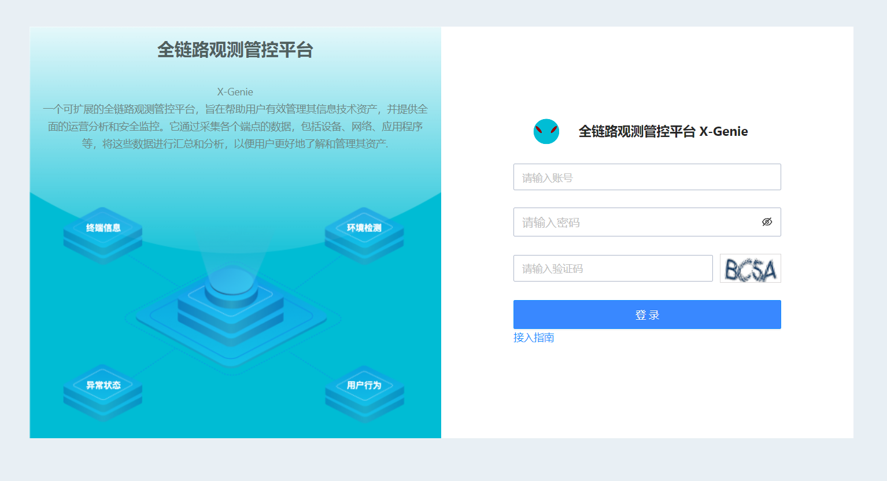
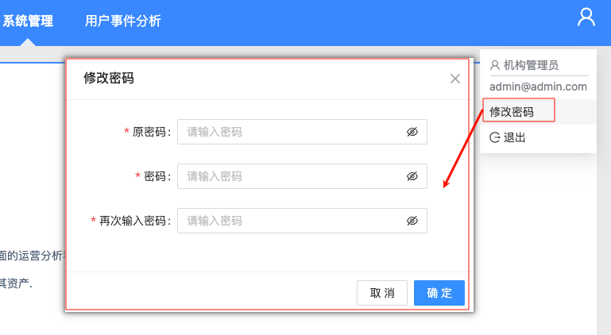
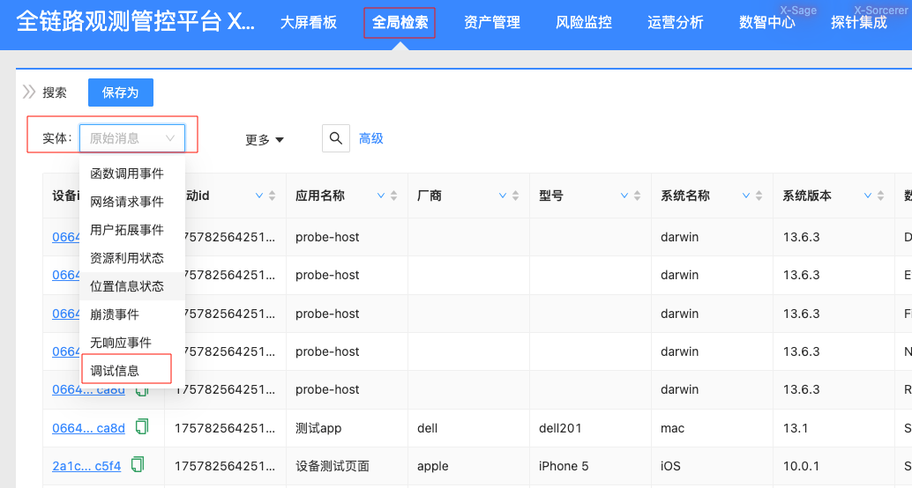
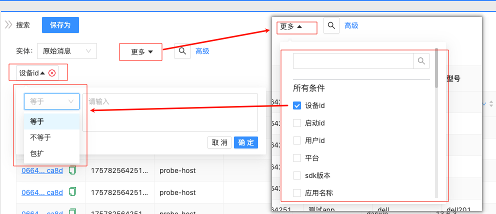
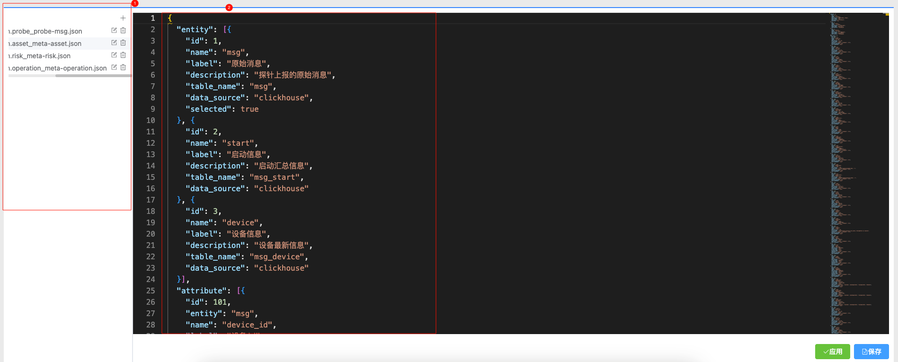
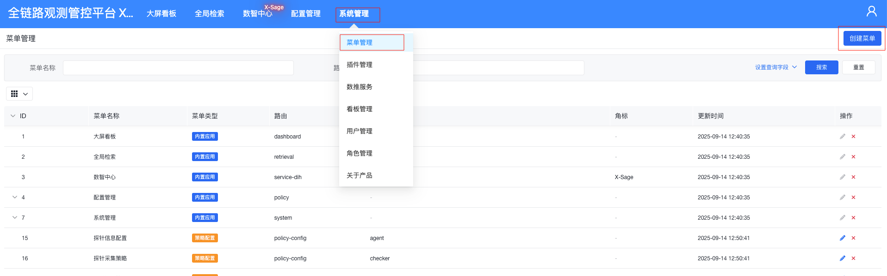
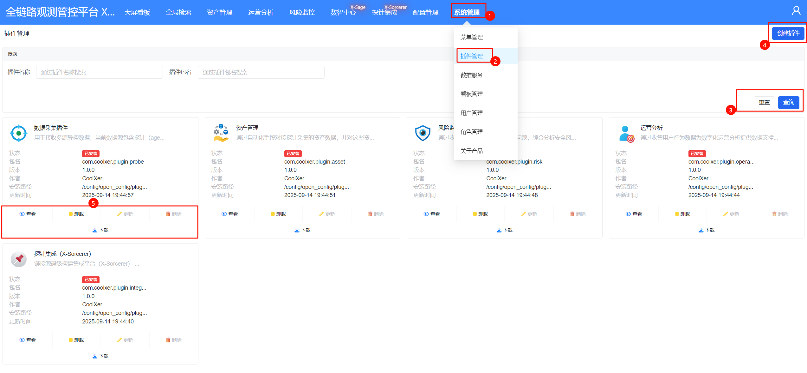
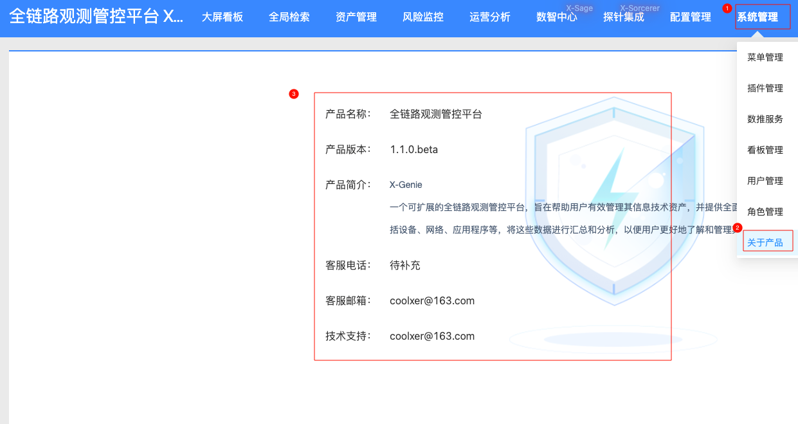

# 使用手册

## 登录与会话

### 账号登录

打开 ZenVis Web，输入邮箱、密码和验证码登录。登录成功后，后端创建 Session，前端根据用户角色加载菜单并跳转到首页。



账号连续失败、验证码或密码策略由当前部署配置和后端实现控制。首次使用初始化账号后应立即修改密码。

### 第三方登录

前端支持 URL query 中携带 `token` 和可选 `salt`。路由守卫保存认证信息后立即从地址栏移除参数，再进入目标页面。外部系统应使用 HTTPS，避免 Token 出现在代理日志和历史记录中。

### 登出与修改密码

登出会清理服务端 Session、Redis Session 数据和浏览器 Cookie。修改密码位于用户相关菜单，修改成功后按页面提示重新登录。



## 首页与看板

首页展示系统概览和实体统计。看板支持四类：

| 类型 | 标识 | 打开方式 |
| --- | --- | --- |
| 内置看板 | `BUILT` | 前端按路由编码加载内置组件 |
| 低代码看板 | `LOW_CODE_PAGE` | 按 `config_index` 渲染页面 |
| HTML 看板 | `HTML_PAGE` | 加载插件或平台静态 HTML |
| 外链看板 | `LINK` | 打开配置的 HTTP/HTTPS 地址 |

系统始终保留默认看板。带 `id`、兼容 `code` 或 `name` 的地址可以打开指定看板；未知内置编码显示空状态，不回退到其他看板。


## 全局检索

### 创建查询

1. 选择实体。
2. 选择普通筛选或高级筛选。
3. 配置展示字段。
4. 点击查询，在结果表格中分页、排序或打开详情链接。



实体和字段来自 Meta。结果列使用属性逻辑名称，显示标题使用属性标签。

### 普通筛选

普通筛选通过字段、操作符和值构建条件，多个条件支持 AND 或 OR。受限候选字段只能从候选值中选择；启用自动补全的字段会查询候选建议。



### 高级筛选

高级模式支持安全子集表达式，例如：

```sql
ip = '10.0.0.1'
module_type_name = '网站攻击' and attack_type_name in ('信息泄露', 'SQL注入')
```

允许的字段必须来自当前实体，操作符包括常用比较、`like`、`between`、`in` 与空值判断。不支持任意 SQL、子查询、函数和注释拼接。


### 保存过滤器

过滤器保存实体、模式、条件、展示列和检索设置，只对创建用户可见。加载有效过滤器时一次性返回配置、元数据和状态，再执行查询。

Meta 变化后，过滤器可能标记为失效。失效过滤器保留原条件供修复，但系统不会自动执行；修复所有问题后才能重新保存和查询。

### 结果与跳转

- 展示字段至少保留一个；
- 排序字段必须属于当前实体；
- JSON 和数组字段使用结构化展示；
- 含 `link_template` 的字段可以进入记录详情、IP 统计或业务页面；
- 复制按钮只对 Meta 声明可复制的字段显示。

## 数智中心

数智中心由左侧会话、中间对话区和右侧业务工作台组成。不同入口拥有不同提示词、Skill、工具和结果面板。

### 知识问答与深度思考

普通问答使用会话记忆，并在启用 embedding 时检索公共 RAG。深度思考使用相同 RAG 范围，但要求模型返回可展示的思考片段。两者都不会调用 MCP 工具。


### 附件

可以上传文本或图片：

- 文本附件最多读取前 80,000 字符进入模型上下文；
- 图片发送给支持视觉能力的模型；
- 不支持解析的文件只提供名称、大小和类型，模型不能声称读取了内部内容。

### 业务 Agent

| Agent | 主要用途 | 数据边界 |
| --- | --- | --- |
| 数据接入 | 梳理数据字典、接入方案和配置 | 显式 Skill 与允许的 MCP 工具 |
| 数据可视化 | 查询真实实体数据并给出分析 | 只读 Retrieval MCP 工具 |
| 研判分析 | 组织分析链、证据和结论 | 研判 Skill 与授权工具 |
| 策略控制 | 生成或执行受控策略 | 写操作受审批策略控制 |
| 报表制作 | 生成、改写和归档报告 | 报表文档工作台 |

业务 Agent 不使用公共 RAG，避免把插件文档当作可执行指令。

### MCP 审批

工具策略分为：

- `ALLOW`：直接执行；
- `ASK`：在当前消息内显示审批卡片；
- `DENY`：禁止执行。

审批支持允许本次、本会话允许或拒绝。停止生成、超时和取消会结束仍在等待的请求；已完成调用仍保留审计记录。

### 报表制作

报表 Agent 可以生成 Markdown/HTML 正文，并同步到右侧编辑器。工作台支持：

- 生成初稿、继续写、摘要、标题和结论；
- 对选区润色、缩写或扩写；
- 自动生成大纲；
- 保存当前文档、归档版本；
- 导出 Markdown 或 HTML。


## 服务管理

### 数据推送服务

查看和维护 Vectum 推送任务，关注运行状态、日志、配置与异常。修改任务前应了解其 Source、Kafka、Transform、Sink 和 DLQ 关系。

### AI 分析任务

后台任务支持创建、编辑、排队、计划执行、取消和审批。任务按计划时间、优先级和创建时间调度；服务重启后未完成执行会以新的 execution ID 重新入队。

### 业务应用服务

业务应用服务页面展示：

- 服务和实例数量、在线/离线状态；
- 版本、环境、主机、端口和管理地址；
- 最近心跳与状态消息；
- 事件类型、严重级别、消息、Trace ID 和扩展数据。

默认离线阈值与数据保留周期由后端 `app.business-service.*` 配置控制。

## 配置管理

配置管理提供文件树、Schema、读取、修改、应用、新增、重命名和删除能力。修改前应确认配置类型和目标文件，应用失败时保留原内容并根据校验信息修正。

### Meta 配置

Meta 顶层包含 `entity`、`attribute` 和 `operator`：

- `entity` 定义实体、表、数据源、排序和自动建表；
- `attribute` 定义逻辑字段、物理列、类型、显示、操作符、候选和链接；
- `operator` 定义可用检索操作。

Meta、Vector 输出和 ClickHouse 表结构必须一致。配置保存前使用 Schema 校验，必要时再使用 AI 补全辅助生成。



## 系统管理

### 菜单管理

菜单决定导航、路由类型、参数、层级和顺序。新增菜单后，需要把权限分配给对应角色；内置超级管理员会自动获得新菜单。



### 用户与角色

- 用户可以新增、编辑、删除、启停和修改密码；
- 角色负责菜单权限和用户范围；
- 内置超级管理员用户和角色不可由普通管理页面编辑或删除；
- 普通管理员看不到超级管理员身份，也不能把该角色分配给其他用户。


### 看板管理

维护看板名称、类型、默认状态和各类型参数。HTML 路径必须是相对路径；外链必须使用允许的 HTTP/HTTPS 地址。

### 插件管理

标准流程：

1. 上传 `.tar.gz` 插件包；
2. 查看插件信息、README 和文档树；
3. 安装或升级；
4. 检查 Meta、推送任务、API、UI、看板、MCP、Skill 和菜单；
5. 为角色分配新菜单；
6. 必要时导出、卸载或删除插件记录。



安装日志用于定位失败阶段。卸载不会删除插件业务表和迁移历史。

### 关于产品

维护系统标题、产品名称、版本、简介、客服信息、技术支持、接入指南链接、版权以及 Logo/Banner。



## 常见问题

### 过滤器加载后出现多个查询

有效规则应只触发一次详情请求和一次数据请求。快速切换时只有最后一次请求可以更新表格。

### 看不到插件菜单

确认插件已安装、菜单已生成，并在角色管理中分配权限。重新登录使菜单权限重新加载。

### AI 工具一直等待

检查是否存在待处理的 `ASK` 审批、请求是否超时，以及当前用户是否有处理权限。

### 业务服务显示离线

检查应用到 ZenVis `11001` 的网络、心跳间隔、实例 ID 稳定性和服务端离线阈值。

