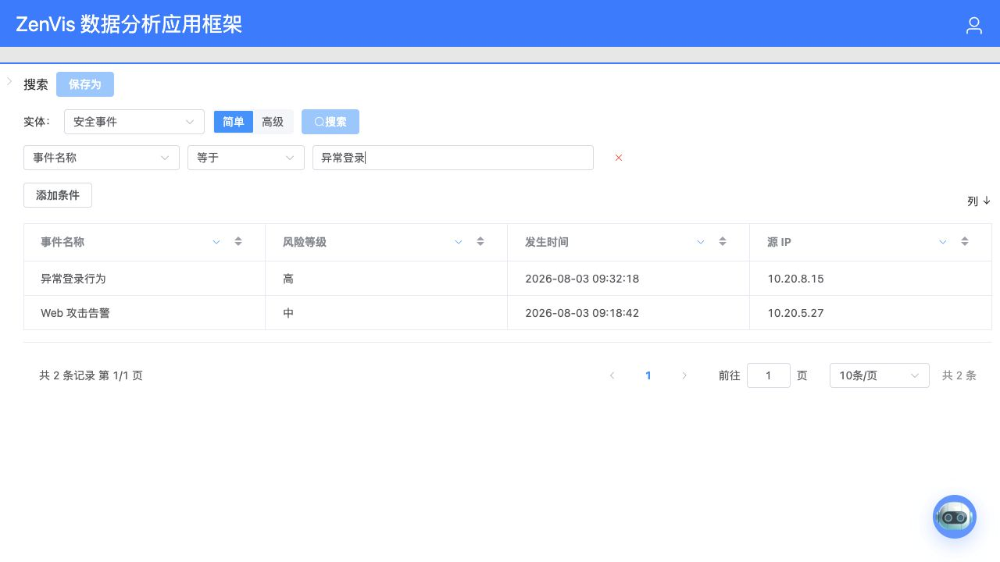

# 全局检索

## 功能定位

全局检索基于 Meta 提供统一的实体选择、条件过滤、字段展示、排序、分页和详情跳转能力。

## 进入方式

在顶部导航选择“全局检索”。页面上部配置查询，页面下部展示结果，左侧抽屉管理个人过滤器。

## 页面说明


- 实体、字段、候选值和操作符来自当前 Meta。
- 普通筛选使用可视化条件；高级筛选使用受限表达式。
- 展示字段决定结果表格的列。
- 个人过滤器保存查询模式、条件、展示列和排序设置。

## 核心操作

### 普通筛选

1. 选择实体和展示字段。
2. 添加字段、操作符和值。
3. 用 AND 或 OR 连接多个条件。
4. 点击查询。



### 高级筛选

高级模式支持字段比较、`like`、`between`、`in` 和空值判断，例如：

```sql
ip = '10.0.0.1'
module_type_name = '网站攻击' and attack_type_name in ('信息泄露', 'SQL注入')
```


### 保存过滤器

打开左侧抽屉可以新建、加载和删除个人过滤器。Meta 变化导致字段或操作符失效时，过滤器会标记问题且不会自动查询；修复后再保存。

## 权限与约束

- 高级筛选不是任意 SQL，不支持函数、子查询、注释或多语句。
- 字段必须属于当前实体，排序字段和展示字段也必须有效。
- 过滤器按创建用户隔离。
- 含跳转模板的字段可以打开记录详情、IP 统计或业务页面。

## 常见问题

### 没有可选实体

确认至少有一份有效 Meta 已应用，并检查当前角色是否能进入相关插件页面。

### 已保存过滤器显示失效

Meta 的实体、字段或操作符已变化。按页面问题提示修复条件和展示列后重新保存。

## 关联功能

- [元数据配置](/01-产品理念与使用/配置管理/元数据配置.md)
- [数据可视化](/01-产品理念与使用/数智中心/数据可视化.md)
- [数据与检索架构](/06-架构设计/数据与检索架构.md)
