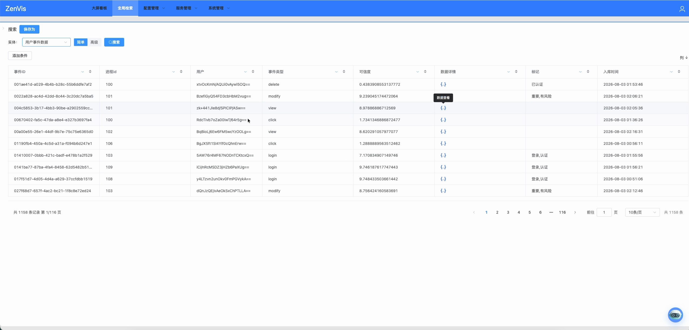
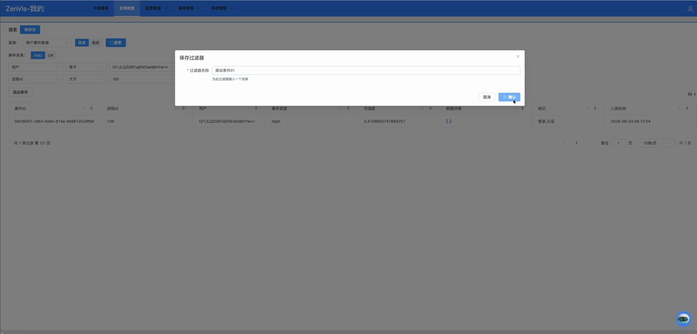
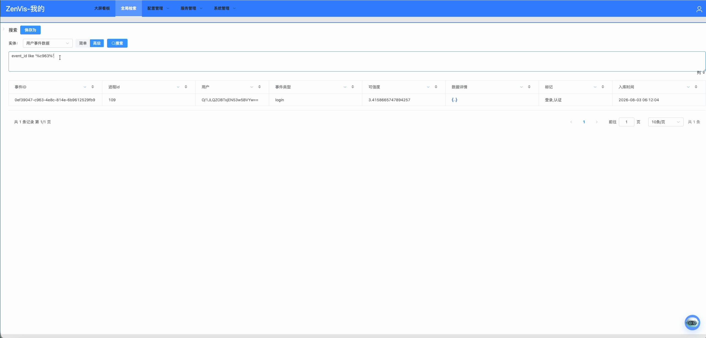
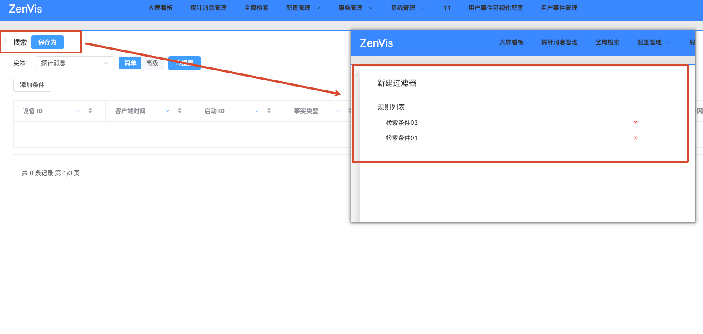

# 全局检索

## 功能定位

全局检索基于 Meta 提供统一的实体选择、条件过滤、字段展示、排序、分页和详情跳转能力。

## 进入方式

在顶部导航选择“全局检索”。页面上部配置查询，页面下部展示结果，左侧抽屉管理个人过滤器。

## 页面说明



- 实体、字段、候选值和操作符来自当前 Meta。
- 普通筛选使用可视化条件；高级筛选使用受限表达式。
- 展示字段决定结果表格的列。
- 个人过滤器保存查询模式、条件、展示列和排序设置。

## 操作前检查

- 确认目标实体已经应用 Meta，且至少存在一个可展示字段。
- 明确本次查询的时间范围和必要条件，避免对大实体直接执行无条件全量检索。
- 高级筛选先在普通筛选中验证字段名与操作符，再编写受限表达式。

## 核心操作

### 普通筛选

1. 在“实体”下拉框选择业务对象，系统会自动加载字段并执行初始查询。
2. 点击“列”选择结果表需要展示的字段；至少保留一列。
3. 点击“添加条件”，依次选择字段、操作符和值。`between` 需要填写起止值，`in` 每行填写一个值。
4. 有多个条件时选择 AND 或 OR；AND 要求全部满足，OR 只需满足任一条件。
5. 点击“搜索”，检查记录数、分页和表格列；点击列标题可排序。

保存过滤器前应先确认条件已收窄结果，再点击“保存为”，填写便于识别的名称。



### 高级筛选

高级模式支持字段比较、`like`、`between`、`in` 和空值判断，例如：

```sql
ip = '10.0.0.1'
module_type_name = '网站攻击' and attack_type_name in ('信息泄露', 'SQL注入')
```



1. 切换到“高级”，输入只包含当前实体字段的 where 表达式。
2. 字符串使用单引号，多个值使用 `in ('值1', '值2')`，区间使用 `between`。
3. 点击“搜索”；出现语法提示时按提示修正，不要改写为完整 SQL。

### 保存过滤器

打开左侧抽屉可以新建、加载和删除个人过滤器。Meta 变化导致字段或操作符失效时，过滤器会标记问题且不会自动查询；修复后再保存。


保存前先执行一次查询确认结果，然后点击“保存为”并填写可识别的名称。更新已有过滤器时，检查实体、条件、展示列和排序是否都需要同步保存。

## 结果确认

- 表格列与“列”选择一致，记录数和分页总数随条件变化。
- 过滤条件生效后抽查 1～2 条记录，确认字段值确实满足条件。
- 保存的过滤器能从左侧抽屉重新打开；若显示失效项，应先修复再执行。

## 权限与约束

- 高级筛选不是任意 SQL，不支持函数、子查询、注释或多语句。
- 字段必须属于当前实体，排序字段和展示字段也必须有效。
- 过滤器按创建用户隔离。
- 含跳转模板的字段可以打开记录详情、IP 统计或业务页面。

## 常见问题

### 没有可选实体

确认至少有一份有效 Meta 已应用，并检查当前角色是否能进入相关插件页面。

### 已保存过滤器显示失效

Meta 的实体、字段或操作符已变化。按页面问题提示修复条件和展示列后重新保存。

## 关联功能

- [元数据配置](/01-产品理念与使用/配置管理/元数据配置.md)
- [数据可视化](/01-产品理念与使用/数智中心/数据可视化.md)
- [数据与检索架构](/06-架构设计/数据与检索架构.md)
