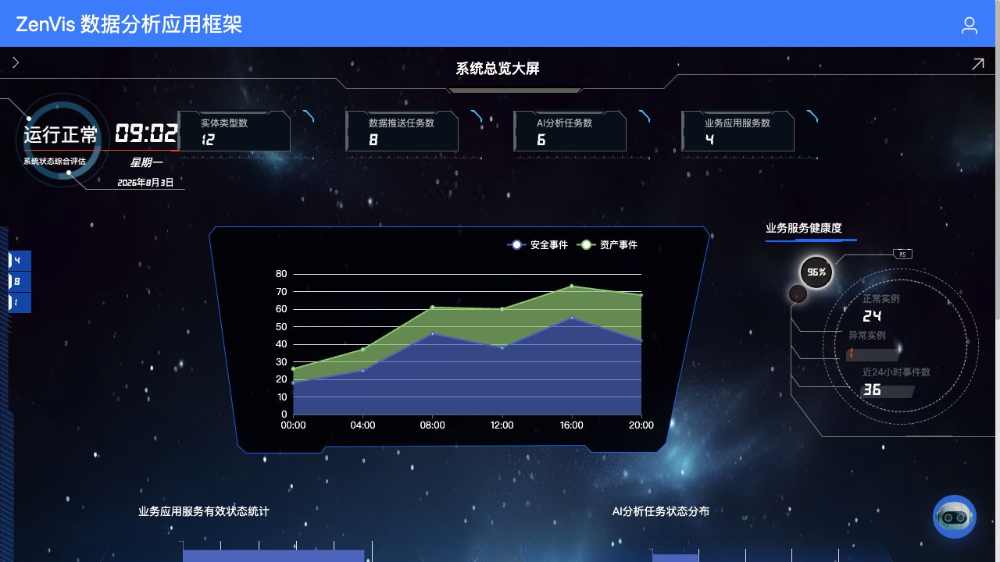
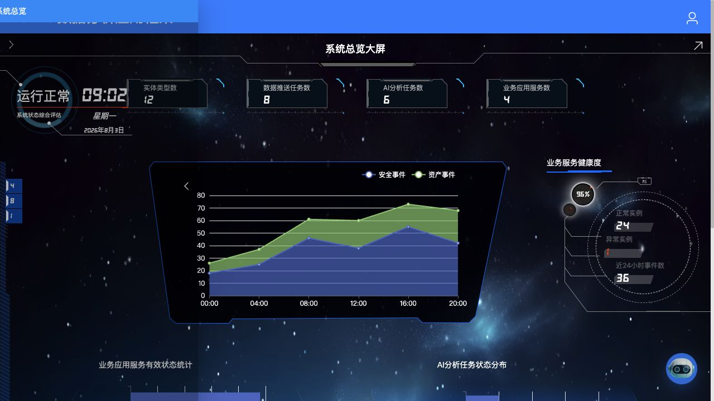

# 大屏看板

## 功能定位

大屏看板是登录后的默认业务入口，用于展示系统状态、实体趋势和已配置的专题页面。

## 进入方式

在顶部导航选择“大屏看板”。未指定看板时显示默认项；链接也可以通过看板 `id` 打开指定内容。

## 页面说明

看板支持四种类型：

| 类型 | 用途 |
| --- | --- |
| `BUILT` | 平台内置 Vue 组件，例如系统状态总览。 |
| `LOW_CODE_PAGE` | 按配置索引渲染低代码页面。 |
| `HTML_PAGE` | 加载平台或插件提供的静态 HTML。 |
| `LINK` | 打开允许的 HTTP/HTTPS 外部地址。 |

页面左侧箭头打开看板选择抽屉，当前看板会高亮显示。

## 操作前检查

- 确认目标看板已在“看板管理”中启用，并且当前账号拥有对应入口权限。
- 外链或 HTML 看板需要浏览器能够访问目标地址；内网资源还要确认 VPN、代理和证书状态。
- 用于会议或大屏展示时，提前检查分辨率、缩放比例和自动休眠设置。

## 核心操作

1. 进入页面后先等待指标、趋势图和状态卡片完成加载。
2. 点击左侧箭头打开选择抽屉，当前看板以高亮状态显示。
3. 点击目标看板，确认抽屉收起且主体内容切换完成。
4. 需要固定入口时，从“看板管理”获取看板 ID，使用 `#/dashboard/index?id=<看板ID>` 形式的链接。
5. 展示结束后恢复默认缩放，避免影响其他后台管理页面。

## 结果确认

- 看板标题、指标时间范围和最后更新时间符合预期。
- 图表没有持续显示加载、空白 iframe 或“内置看板不存在”。
- 分享链接在新窗口打开后仍指向同一看板；不要只复制切换前的地址。

## 权限与约束

- 系统始终保留一个默认看板。
- 内置看板编码必须存在对应前端组件；未知编码会显示空状态。
- HTML 页面路径必须是相对路径；外链只接受允许的 HTTP/HTTPS 地址。
- 看板的创建、编辑和默认项设置在[看板管理](/01-产品理念与使用/系统管理/看板管理.md)完成。

## 常见问题

### 进入后显示“内置看板不存在”

检查看板类型是否为 `BUILT`，以及路由编码是否为前端支持的编码。

### 链接打开的不是目标看板

优先使用看板 ID；旧的 `code` 和 `name` 参数只用于兼容历史链接。

## 关联功能

- [看板管理](/01-产品理念与使用/系统管理/看板管理.md)
- [数据可视化](/01-产品理念与使用/数智中心/数据可视化.md)
- [静态页面配置](/01-产品理念与使用/配置管理/静态页面配置.md)
