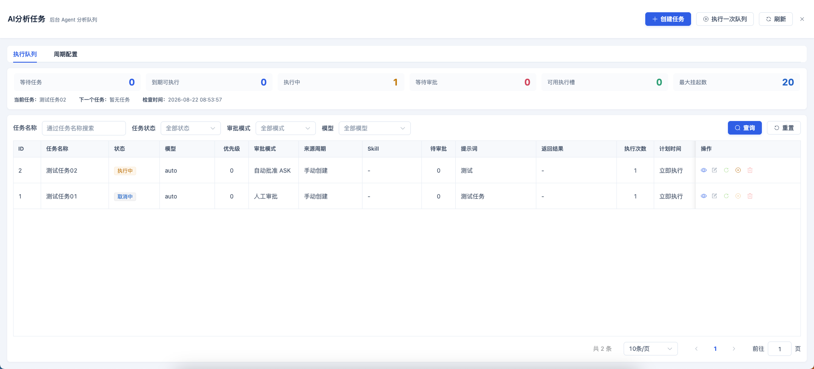
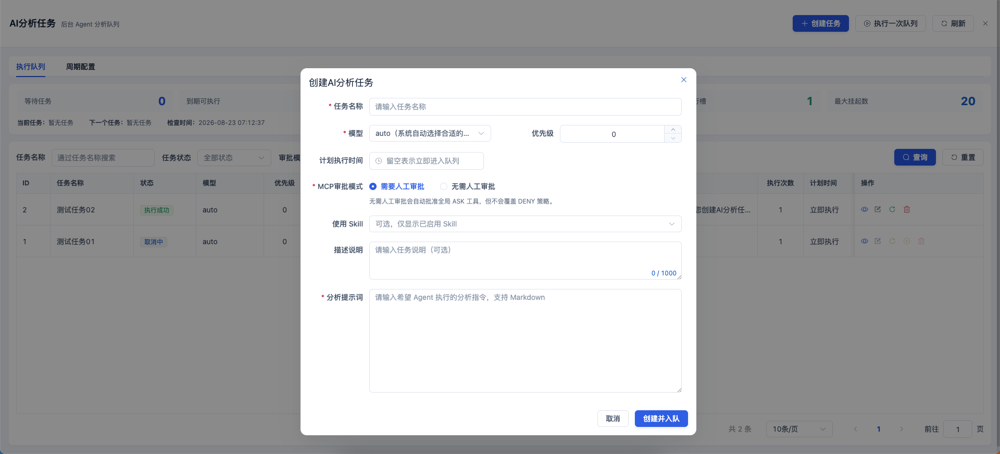
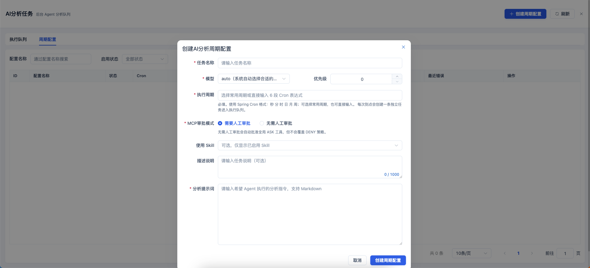
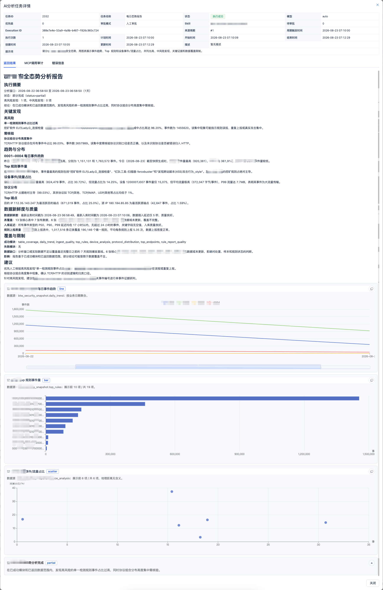

# AI 分析任务

## 功能定位

AI 分析任务把需要后台执行的 Agent 工作放入队列。单次任务是一个完整执行实例；周期配置只负责按 Cron 持续创建新的任务实例，因此每次执行都有独立的状态、结果和审计。

## 进入方式

在顶部导航进入 **数智中心 → AI 分析任务**。页面默认显示任务列表，可在这里创建临时任务或周期性任务。

## 页面说明

- 任务列表显示名称、类型、状态、调度信息、执行时间和操作入口，并可按任务名称及状态筛选。
- 临时任务只执行一次；周期性任务按 Cron 配置持续生成相互独立的执行记录。
- 任务可以创建、编辑、重新入队、取消、查看详情和删除。
- 周期配置可以创建、编辑、启停、删除，并可跳转查看它生成的全部任务。
- 人工审批模式下，待处理 MCP 请求在任务行中显示数量和处理入口。

## 操作前检查

- 准备可独立执行的提示词，写清输入范围、输出要求、失败处理和完成判定。
- 确认所选模型与 Skill 可用，并核对任务可能调用的 MCP 工具策略。
- 计划执行时间和 Cron 使用部署实例时区；高风险任务优先选择人工审批。

## 核心操作

1. 进入任务列表，先按名称或状态确认没有重复任务。
2. 点击“创建临时任务”，填写任务名称、分析要求、模型、Skill、计划执行时间和审批模式，保存后任务进入执行队列。

3. 需要重复执行时点击“创建周期性任务”，填写周期名称、任务模板和 Cron；Cron 使用 Spring 6 段格式（`秒 分 时 日 月 周`）。

4. 选择审批模式：人工审批适合写入或外部动作；自动批准只适合已评估的 `ASK` 工具。
5. 单次执行保存后直接进入队列；周期执行保存后只创建周期配置，从下一个 Cron 匹配时间开始生成任务。
6. 出现 `WAITING_APPROVAL` 时打开审批入口，核对工具、参数和影响后及时处理。
7. 每个周期生成的任务完成后保持 `SUCCESS`、`FAILED` 或 `CANCELED`；不再需要未来任务时停用或删除周期配置。
8. 打开成功任务的结果，核对分析过程、图表、结论和数据范围；例如态势分析结果应同时给出趋势证据和可执行建议。

## 结果确认

- 任务进入预期队列，计划时间、优先级、模型、Skill 和审批模式显示正确。
- 成功任务能查看返回结果和执行次数；失败任务保留可定位原因的状态或错误信息。周期结果按独立任务行展示。
- 队列没有长期占用执行槽的僵死任务，待审批数量与实际请求一致。

## 权限与约束

- 执行中的任务不能直接编辑或删除。
- 人工审批请求具有过期时间；超时、取消和停止会结束未完成请求。
- 自动批准只影响任务运行中的 `ASK` 调用，不会绕过 `DENY`。
- 服务重启后未完成执行可能以新的 execution ID 重新入队。

## 常见问题

### 任务一直等待审批

打开任务的审批入口，检查是否存在未处理请求及其过期时间。

### 任务没有按计划执行

单次任务检查计划时间和队列状态；周期任务检查配置是否启用、Cron、下次触发时间和最近错误。超过误触发宽限的历史周期不会补投。

## 关联功能

- [MCP 服务](/01-产品理念与使用/系统管理/MCP服务.md)
- [Skill 管理](/01-产品理念与使用/系统管理/Skill管理.md)
- [报表制作](/01-产品理念与使用/数智中心/报表制作.md)
