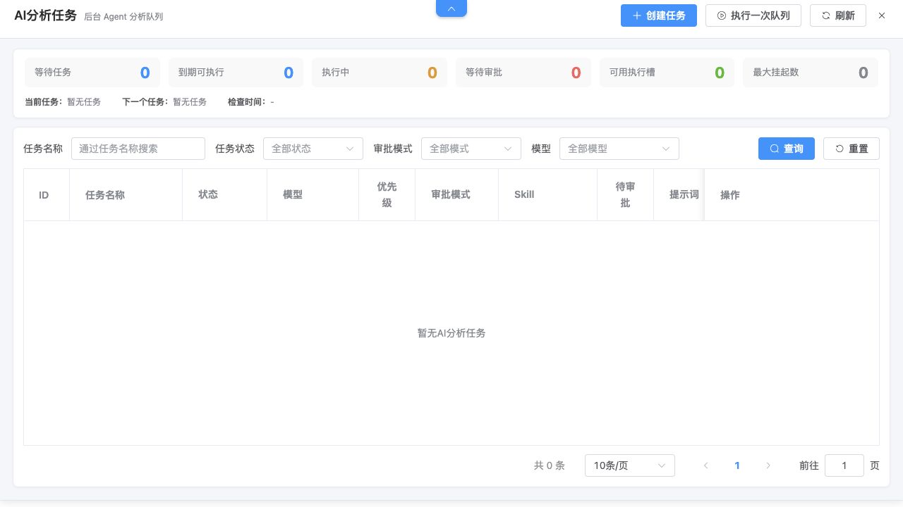

# AI 分析任务

## 功能定位

AI 分析任务把需要后台执行的 Agent 工作放入队列，提供计划时间、优先级、审批模式、状态跟踪和结果查看。

## 进入方式

进入完整数智中心，点击页面顶部的抽屉触发器打开“AI 分析任务”。

## 页面说明

- 队列概览显示当前任务、下一任务和检查时间。
- 列表支持按名称、状态、审批模式和模型筛选。
- 任务可以创建、编辑、重新入队、取消、查看详情和删除。
- 人工审批模式下，待处理 MCP 请求在任务行中显示数量和处理入口。

## 核心操作

1. 点击“创建任务”，填写名称、提示词、模型、Skill、优先级和计划时间。
2. 选择自动批准 `ASK` 或人工审批。
3. 保存后观察 `PENDING`、`RUNNING`、`WAITING_APPROVAL` 等状态。
4. 需要时处理审批、查看详情、重新入队或取消任务。

## 权限与约束

- 执行中的任务不能直接编辑或删除。
- 人工审批请求具有过期时间；超时、取消和停止会结束未完成请求。
- 自动批准只影响任务运行中的 `ASK` 调用，不会绕过 `DENY`。
- 服务重启后未完成执行可能以新的 execution ID 重新入队。

## 常见问题

### 任务一直等待审批

打开任务的审批入口，检查是否存在未处理请求及其过期时间。

### 任务没有按计划执行

检查计划时间、队列状态、后台调度器和任务是否被取消或阻塞。

## 关联功能

- [MCP 服务](/01-产品理念与使用/系统管理/MCP服务.md)
- [Skill 管理](/01-产品理念与使用/系统管理/Skill管理.md)
- [报表制作](/01-产品理念与使用/数智中心/报表制作.md)
