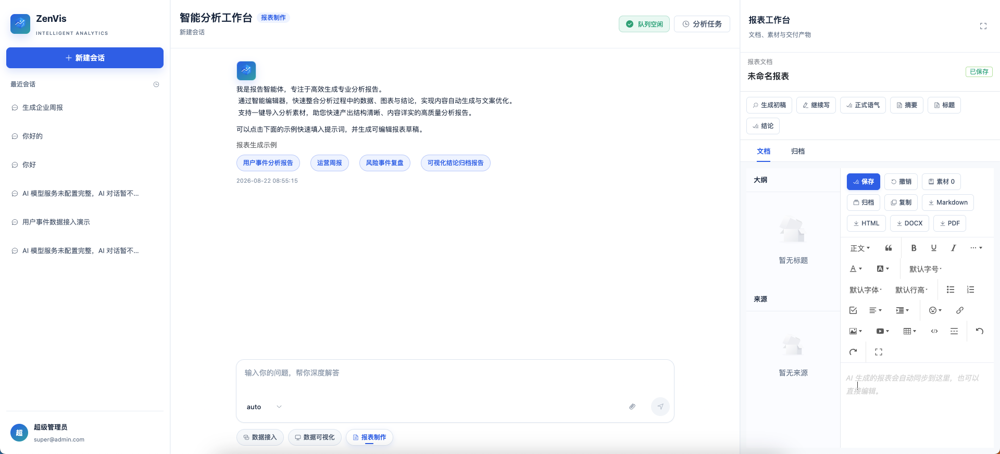

# 报表制作

## 功能定位

报表制作 Agent 将会话、附件和其他分析结果组织为结构化文档，并在右侧工作台中持续编辑、保存、归档和导出。

## 进入方式

进入完整数智中心，在功能入口选择“报表制作”。右侧显示报表编辑器和文档操作区。

## 页面说明

- 对话区负责生成、改写和解释。
- 右侧编辑器保存当前 Markdown 或 HTML 正文。
- 快捷操作支持继续写、摘要、标题、结论、大纲和全文改写。
- 选区操作只处理当前选中文本。
- 文档可以保存当前状态、归档版本并导出 Markdown 或 HTML。

## 核心操作

1. 说明报表主题、读者、范围、格式和关键结论。
2. 上传或引用需要汇总的材料。
3. 生成初稿并在右侧核对正文。
4. 通过自然语言或选区操作迭代内容。
5. 保存、归档并导出最终版本。

## 权限与约束

- Agent 只处理当前会话可访问的内容和附件。
- 完整生成或全文改写会更新整篇正文；选区操作只替换选中片段。
- 导出前应人工核对事实、数据、结论和敏感信息。
- 归档用于保存版本，不替代外部正式文档审批流程。

## 常见问题

### 回答已生成但右侧没有正文

确认本次回答包含报表文档结果；普通聊天文本不会自动覆盖右侧编辑器。

### 选区改写作用到了全文

重新选择目标文字后使用选区快捷操作，不要发送“重写整篇”类指令。

## 关联功能

- [知识问答](/01-产品理念与使用/数智中心/知识问答.md)
- [数据可视化](/01-产品理念与使用/数智中心/数据可视化.md)
- [AI 分析任务](/01-产品理念与使用/数智中心/AI分析任务.md)
