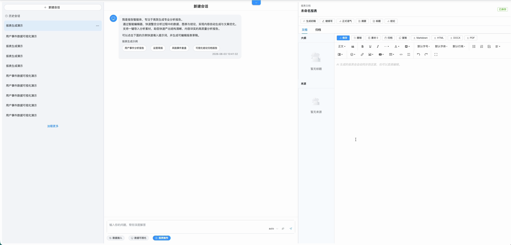
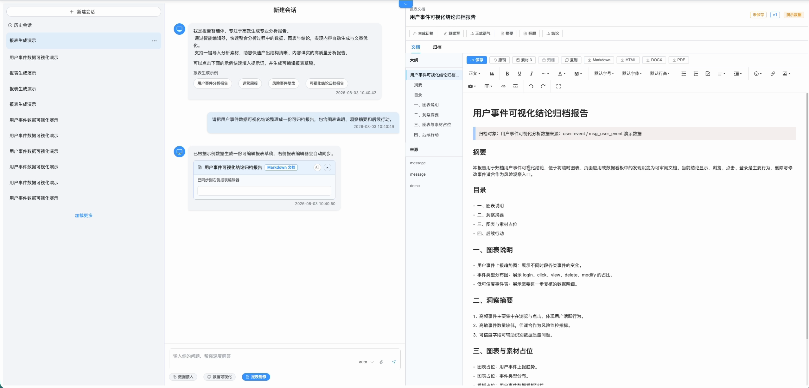
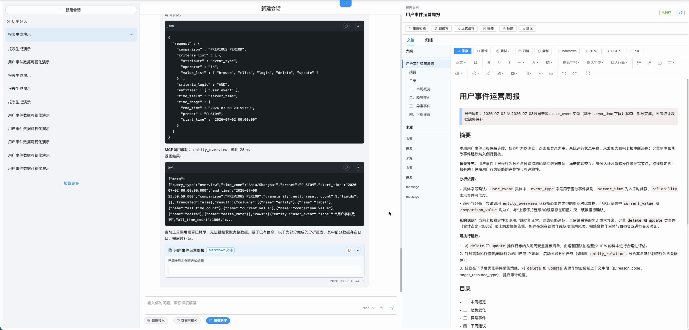
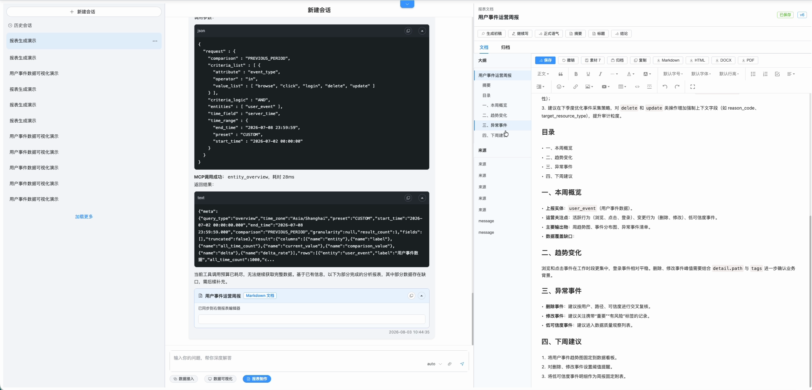

# 报表制作

## 功能定位

报表制作 Agent 将会话、附件和其他分析结果组织为结构化文档，并在右侧工作台中持续编辑、保存、归档和导出。

## 进入方式

进入完整数智中心，在功能入口选择“报表制作”。右侧显示报表编辑器和文档操作区。

## 页面说明

- 对话区负责生成、改写和解释。
- 右侧编辑器保存当前 Markdown 或 HTML 正文。
- 快捷操作支持继续写、摘要、标题、结论、大纲和全文改写。
- 选区操作只处理当前选中文本。
- 文档可以保存当前状态、归档版本并导出 Markdown 或 HTML。

## 操作前检查

- 明确报表读者、统计周期、数据截止时间、必含章节和交付格式。
- 上传材料前统一文件版本，移除重复或过期附件，并确认敏感信息处理要求。
- 对正式报告先约定数据来源和审核人，AI 生成内容不能替代事实审核。

## 核心操作

1. 进入“报表制作”，填写清晰的报表标题，并在对话中说明读者、范围、章节和语气。
2. 上传或引用材料，检查右侧“来源/素材”数量与预期一致。
3. 新建报表时先确认右侧编辑器处于空白或目标文档，避免覆盖其他报表。

4. 点击“生成初稿”，等待正文同步到右侧编辑器；先核对大纲和关键数据，再调整措辞。

5. 使用“继续写、摘要、标题、结论”等快捷操作，或选中文本后执行局部改写；生成运营周报时核对报告周期、状态提示和数据缺口说明。

6. 在左侧大纲逐章检查结构，在“来源”区确认每项数据或材料可追溯。

7. 每轮重要修改后点击“保存”；需要保留里程碑时执行“归档”。
8. 导出前检查标题、日期、引用、表格、敏感字段和审批结论，再选择 Markdown、HTML、DOCX 或 PDF。

## 结果确认

- 页面显示“已保存”，重新打开会话后正文、标题和来源仍存在。
- 归档页能找到关键版本，导出文件可打开且没有截断、乱码或样式错位。
- 正式交付版本已经由业务负责人核对数据与结论。

## 权限与约束

- Agent 只处理当前会话可访问的内容和附件。
- 完整生成或全文改写会更新整篇正文；选区操作只替换选中片段。
- 导出前应人工核对事实、数据、结论和敏感信息。
- 归档用于保存版本，不替代外部正式文档审批流程。

## 常见问题

### 回答已生成但右侧没有正文

确认本次回答包含报表文档结果；普通聊天文本不会自动覆盖右侧编辑器。

### 选区改写作用到了全文

重新选择目标文字后使用选区快捷操作，不要发送“重写整篇”类指令。

## 关联功能

- [知识问答](/01-产品理念与使用/数智中心/知识问答.md)
- [数据可视化](/01-产品理念与使用/数智中心/数据可视化.md)
- [AI 分析任务](/01-产品理念与使用/数智中心/AI分析任务.md)
