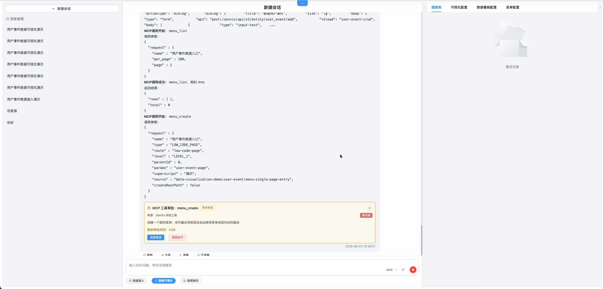
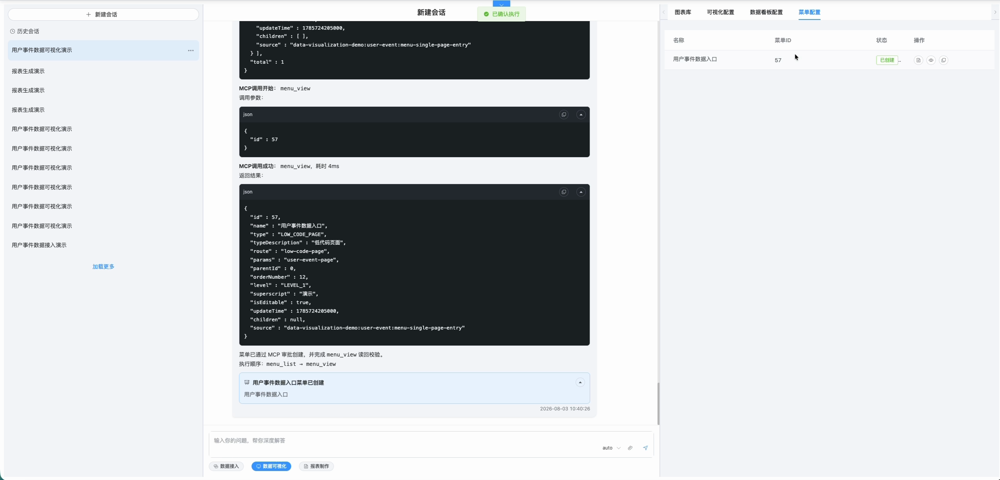
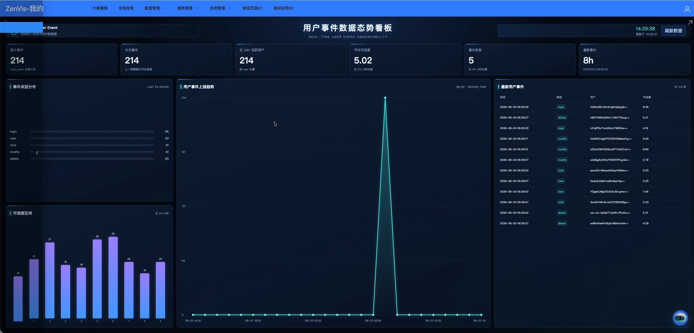

# 数据可视化

## 功能定位

数据可视化 Agent 使用真实 Meta 和实体数据生成临时图表，并可继续形成低代码页面、应用、HTML 页面、数据看板和菜单配置。

## 进入方式

进入完整数智中心，在功能入口选择“数据可视化”。右侧工作台显示图表库、可视化配置、看板和菜单记录。

## 页面说明

- Agent 先解析分析目标，再从可用实体和字段中选择查询范围。
- 临时图表直接在消息或右侧面板中展示。
- 配置记录提供查看、打开配置页和打开最终页面的入口。
- 内置演示可以在无模型环境中展示固定流程；写入仍使用真实 MCP。

## 操作前检查

- 先在全局检索确认实体有数据，并记录可用维度、指标字段和时间字段。
- 明确图表用途、时间范围、聚合口径、排序和刷新频率。
- 需要发布为页面或看板时，提前确认目标名称、菜单层级和访问角色。

## 核心操作

1. 新建会话，按“指标 + 维度 + 时间范围 + 图表类型 + 排序方式”描述需求。
2. 核对 Agent 选择的实体、字段、过滤条件和聚合函数；同名业务指标要明确计算口径。
3. 查看临时图表，同时检查图表下方或消息中的数据证据、单位和记录数量。
4. 通过后继续生成低代码页面、HTML 页面或看板配置；使用清晰且不重复的名称。
5. 涉及页面、看板或菜单写入时，逐项审批 MCP 调用。

6. 从右侧“图表库、可视化配置、数据看板配置”记录打开最终页面，检查标题、坐标轴、空值和响应式布局。

7. 从新入口打开页面并刷新数据，核对指标卡、分类分布、趋势和最近记录使用的是同一实体及时间口径。

## 结果确认

- 图表数值能与全局检索或实体分析结果交叉验证。
- 页面刷新后仍能加载，时间筛选和交互控件行为正常。
- 发布到菜单后，目标角色重新登录可以看到入口，其他角色不会获得额外权限。

## 权限与约束

- 图表必须来自真实实体查询，不应把模型猜测当作数据。
- 实体和字段必须存在于 Meta；实体分析接口按白名单调用。
- 页面、看板和菜单写入属于系统变更，必须满足 MCP 策略和用户权限。
- 看板创建后应读回验证类型、配置索引和目标页面。

## 常见问题

### 图表为空

检查时间范围、筛选条件、实体是否有数据，以及选定字段是否适合聚合。

### 已生成页面但菜单中看不到

确认菜单已创建、角色已分配权限，并重新登录加载最新菜单。

## 关联功能

- [全局检索](/01-产品理念与使用/全局检索.md)
- [大屏看板](/01-产品理念与使用/大屏看板.md)
- [看板管理](/01-产品理念与使用/系统管理/看板管理.md)
- [菜单管理](/01-产品理念与使用/系统管理/菜单管理.md)
