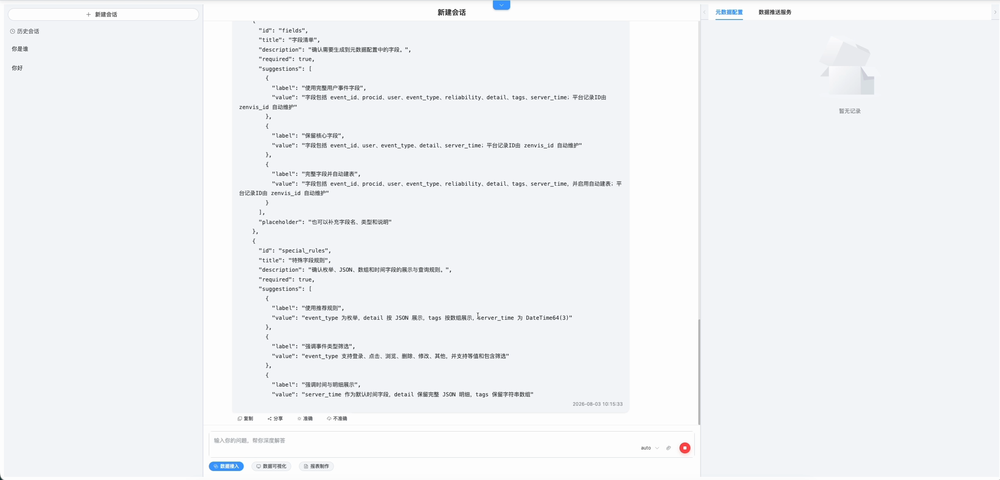
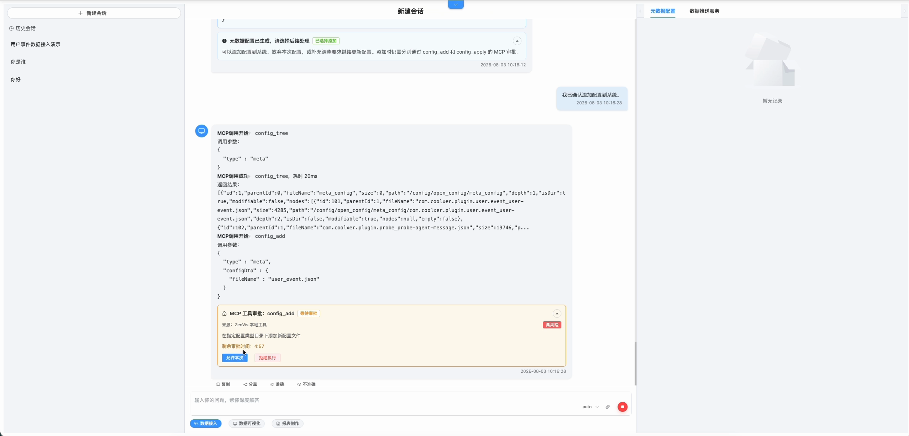
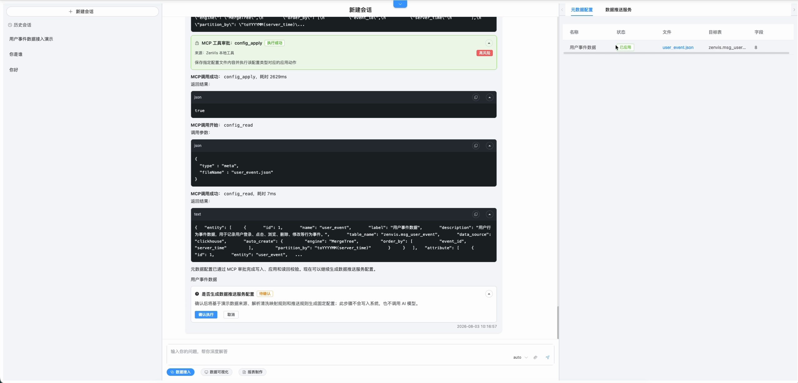
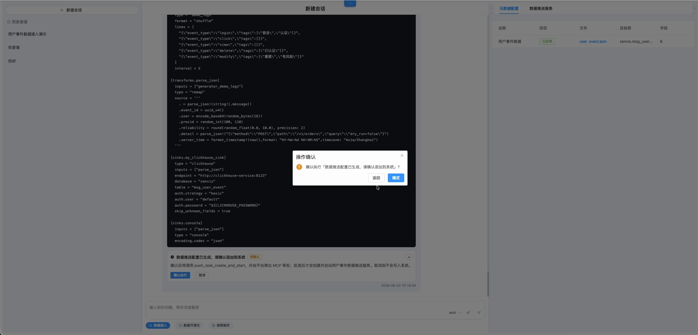
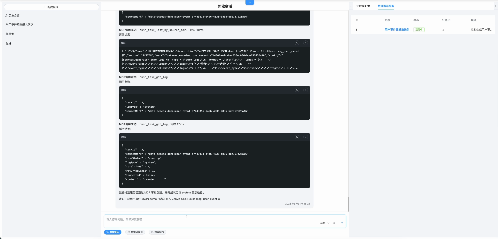

# 数据接入

## 功能定位

数据接入 Agent 根据业务需求和数据字典梳理实体、属性及采集链路，生成可审阅的 Meta 和数据推送任务建议。

## 进入方式

进入完整数智中心，在功能入口选择“数据接入”。右侧工作台会同步展示本次会话产生的配置记录。

## 页面说明

- 中间对话区用于描述数据来源、字段、样例和处理目标。
- 右侧面板归集 Meta、推送任务和执行结果。
- 内置演示可以在没有模型时展示固定的数据接入流程。
- 写入、应用和启动任务使用真实 MCP 工具并受审批策略控制。

## 操作前检查

- 准备数据字典、脱敏样例、更新频率、唯一键、事件时间字段和目标保留周期。
- 确认来源协议、网络方向、认证方式和错误数据处理方式；不要把真实密钥直接发给 Agent。
- 明确本次只生成方案，还是允许写入 Meta、推送任务并启动服务。

## 核心操作

1. 新建数据接入会话，描述来源、格式、字段语义、唯一标识、事件时间和预期数据量。
2. 上传脱敏样例或数据字典，并指出枚举、空值、单位、时区和异常行处理规则。
3. 审阅 Agent 给出的实体名、属性类型、物理列、操作符和存储建议；不确定项先补充信息。

4. 先生成并审阅配置草稿，再明确要求写入。右侧“元数据配置”和“数据推送服务”页签会归集产物。
5. 对 `ASK` 调用逐项核对工具、参数摘要和影响范围，再选择允许或拒绝。

6. 写入后读取配置确认内容一致，应用 Meta，再启动推送任务。

7. 审阅生成的 Vector 推送配置，确认源、转换、目标表和凭据变量后，在二次确认框选择“确定”。

8. 用一小批样例做端到端验证，确认 Source、Kafka、Transform、Sink 和目标实体记录均正常；右侧任务状态应为“运行中”，同时检查系统日志没有持续报错。

## 结果确认

- 右侧工作台出现 Meta 与推送任务记录，且能打开对应配置。
- Meta 应用成功后，全局检索能选择新实体和字段。
- 推送任务状态稳定，日志无持续重试；样例数据的数量、类型和时间字段与源数据一致。

## 权限与约束

- Agent 不能绕过 Meta Schema、MCP scope 或工具审批。
- 数据来源、字段映射和存储类型不明确时，应先补充信息再落地。
- “允许本次”只批准当前调用，不等同于修改长期工具策略。
- 任务实际运行还依赖 Kafka、Vectum、ClickHouse 和网络连通性。

## 常见问题

### 配置已经生成但系统中没有文件

生成内容和写入系统是两个阶段；检查是否已确认写入并批准相应 MCP 请求。

### 数据推送任务创建后没有数据

检查任务状态、系统日志、Source 配置、Kafka 路由、字段映射和 Sink 表结构。

## 关联功能

- [元数据配置](/01-产品理念与使用/配置管理/元数据配置.md)
- [数据推送服务](/01-产品理念与使用/服务管理/数据推送服务.md)
- [MCP 服务](/01-产品理念与使用/系统管理/MCP服务.md)
