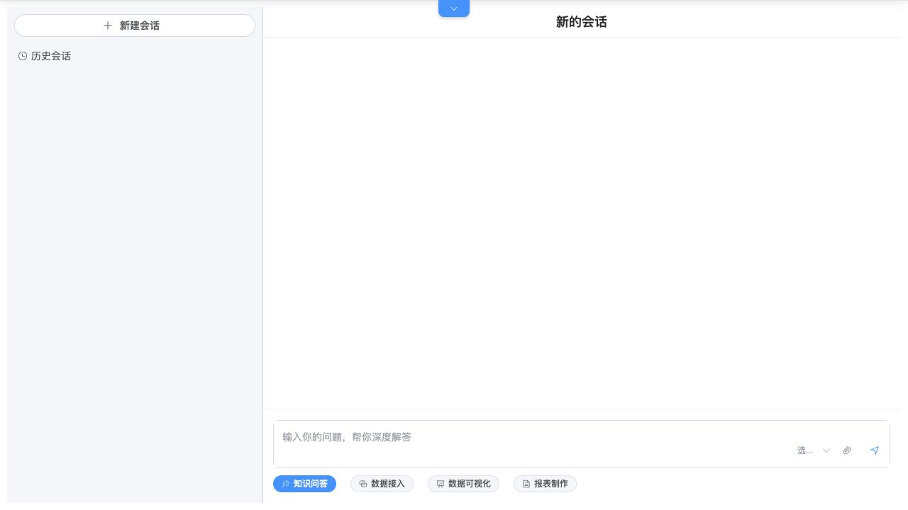

# 知识问答

## 功能定位

知识问答提供带会话记忆的自然语言交流入口，可结合公共 RAG 文档回答产品、业务和使用问题。

## 进入方式

点击页面右下角 AI 浮球进行快捷问答，或选择“在新页面打开对话”进入完整数智中心。完整页面包含会话列表、对话区和功能入口。

## 页面说明

- 左侧管理历史会话，支持新建、置顶、改名、删除和加载更多。
- 中间区域展示消息、附件、模型选择和发送状态。
- “深度思考”是知识问答的可选模式，会展示单独的思考状态。
- 文本附件会在限制长度内加入上下文；图片会发送给支持视觉能力的模型。

## 核心操作

1. 新建会话或选择历史会话。
2. 输入问题，可按需添加附件或启用深度思考。
3. 选择模型并发送。
4. 根据回答继续追问，或将会话置顶、改名和删除。

## 权限与约束

- 普通知识问答不调用 MCP 工具，也不执行系统写入。
- RAG 只有在向量能力和文档已就绪时生效。
- 不支持解析的附件只会向模型提供文件名、大小和类型。
- 模型、上下文窗口和附件大小受部署配置限制。

## 常见问题

### 回答没有引用平台文档

检查公共 RAG 是否已初始化、文档是否已加载，以及当前模型是否配置了 embedding。

### 附件内容没有被读取

确认文件类型受支持且未超过限制；二进制文件不会自动解析为文本。

## 关联功能

- [RAG 文档管理](/01-产品理念与使用/系统管理/RAG文档管理.md)
- [数据接入](/01-产品理念与使用/数智中心/数据接入.md)
- [数据可视化](/01-产品理念与使用/数智中心/数据可视化.md)
