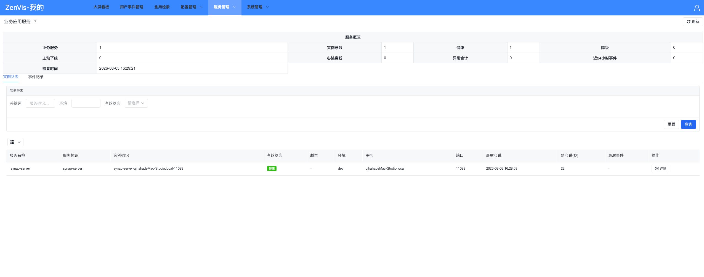

# 业务应用服务

## 功能定位

业务应用服务汇聚外部应用上报的实例心跳和重要事件，提供统一的在线状态、版本环境和异常视图。

## 进入方式

在顶部导航打开“服务管理”，选择“业务应用服务”。

## 页面说明

- 服务概览展示服务数、实例数、健康、降级、心跳离线和近 24 小时事件。
- 实例列表支持按服务标识、名称、实例或主机检索。
- 实例详情包含版本、环境、主机、端口、管理地址、心跳时间和元数据。
- 事件记录支持按类型、级别和时间检索，并显示 Trace ID 与扩展数据。

## 操作前检查

- 明确目标服务标识、实例 ID、环境、时间范围和预期心跳间隔。
- 排障前同步外部服务日志时间，并确认两端时区一致。
- 主动下线或清理实例前，确认它不是正在运行但短时网络不通的实例。

## 核心操作

1. 从概览判断离线和异常规模。
2. 按服务或实例缩小范围。
3. 查看实例最后心跳和状态说明。
4. 联动查看该实例最近事件。
5. 使用 Trace ID 到外部日志系统继续排查。

## 结果确认

- 正常实例的最后心跳持续更新，版本、环境和主机信息与部署一致。
- 异常实例能够通过事件和 Trace ID 关联到外部日志。
- 处理后概览计数在下一个心跳/统计周期内恢复。

## 权限与约束

- 在线状态由服务端离线阈值计算，不等同于外部应用内部健康检查。
- 心跳和事件的接收接口是独立的公开接入契约，生产环境应通过网络边界和部署配置保护。
- 数据保留周期、离线阈值和清理任务由后端配置控制。
- 主动下线只改变平台视图，不会停止外部应用进程。

## 常见问题

### 实例持续显示离线

检查外部应用到 ZenVis 后端的网络、心跳间隔、实例 ID 稳定性和服务器时间。

### 事件存在但概览计数不一致

确认筛选时间范围、事件接收时间和保留周期。

## 关联功能

- [接入模型与运行机制](/05-业务服务接入/接入模型与运行机制.md)
- [Spring Boot Starter 接入](/05-业务服务接入/Spring-Boot-Starter接入.md)
- [业务服务 REST API](/08-API参考/RestfulAPI/业务服务.md)
