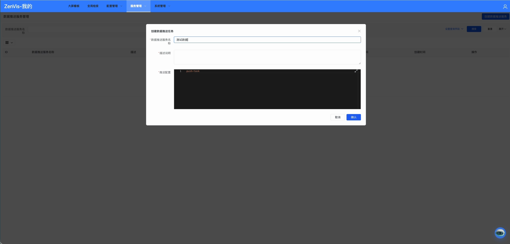
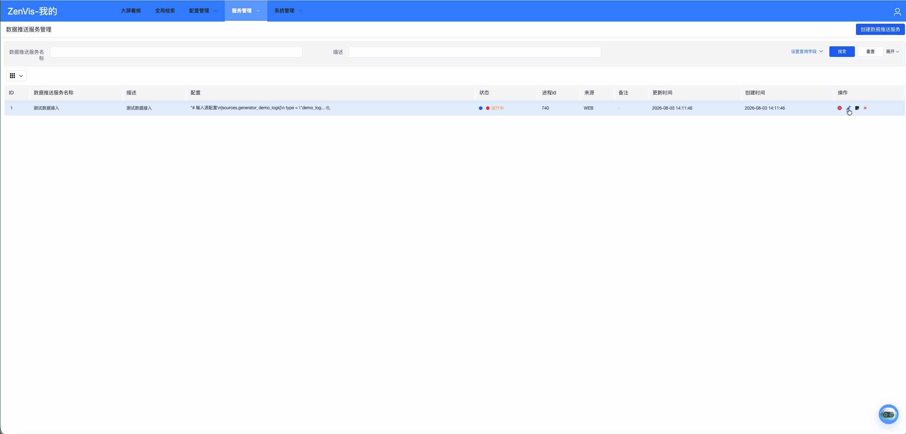
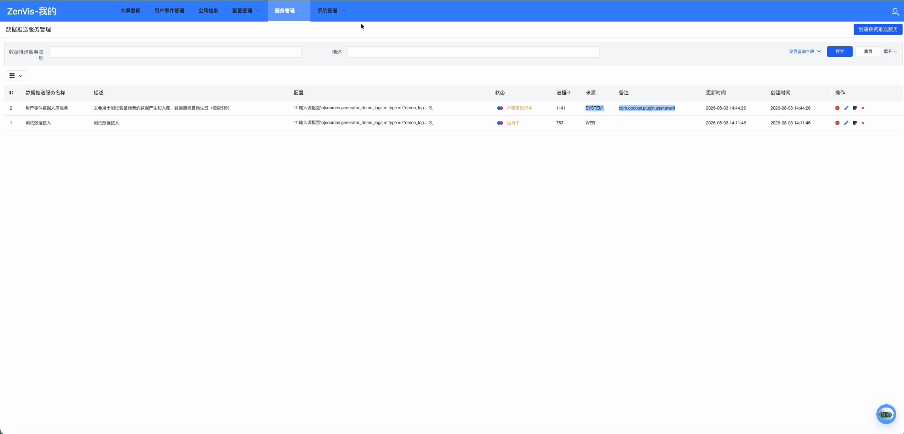

# 数据推送服务

## 功能定位

数据推送服务管理由 Vectum 运行的数据采集、转换、路由和写入任务，并提供状态和日志排查入口。

## 进入方式

在顶部导航打开“服务管理”，选择“数据推送服务”。

## 页面说明

列表展示任务 ID、名称、描述、来源、进程 ID、状态、创建和更新时间。任务状态包括未运行、运行中、不稳定运行中和异常。

页面支持创建、编辑、启停、删除和查看日志。日志分为系统日志与控制台日志。

## 操作前检查

- 准备脱敏样例，确认 Source 连通性、认证方式、Kafka Topic、字段映射和目标实体。
- 估算数据量、并发、重试与重复数据风险，明确 DLQ 或错误行处理方式。
- 编辑运行中任务前记录当前配置、进程 ID、消费位点和维护窗口。

## 核心操作

1. 点击“创建数据推送服务”。
2. 填写唯一名称、用途说明和完整 Vector 配置；重点检查 Source、Transform、Sink、目标表以及环境变量引用。

3. 保存并启动任务。
4. 返回列表检查状态、进程 ID、来源和更新时间；运行中任务可通过操作列停止、编辑或查看日志。

5. 发生异常时再查看控制台日志和完整配置。
6. 插件安装或升级后重新核对 `SYSTEM` 来源任务，确认旧任务与插件任务没有重复写入同一目标。

## 结果确认

- 状态在观察期内保持“运行中”，进程 ID 稳定且没有反复重启。
- 系统日志持续产生正常采集/写入记录，控制台没有认证、映射或 Sink 异常。
- 从目标实体抽查样例，记录数、字段类型、时间和唯一键符合预期。

## 权限与约束

- 任务配置可能包含 Source、Kafka、Transform、Sink 和 DLQ 等阶段。
- 修改运行中的任务前应确认重启影响和数据重复风险。
- 删除任务不会替代对业务表、Kafka Topic 或外部来源的清理。
- 日志可能包含业务字段和错误上下文，分享前应去除敏感信息。

## 常见问题

### 状态为“不稳定运行中”

任务进程仍在，但最近日志包含异常或反复重启。检查 Source、Kafka、字段转换和 Sink。

### 数据没有写入目标实体

核对任务输出字段、Meta 物理列和目标表结构是否完全一致。

## 关联功能

- [数据接入](/01-产品理念与使用/数智中心/数据接入.md)
- [元数据配置](/01-产品理念与使用/配置管理/元数据配置.md)
- [数据接入与推送任务](/03-插件开发与集成/数据接入与推送任务.md)
