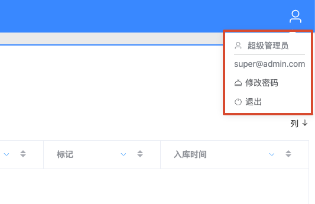

# 登录与账号

## 功能定位

登录与账号功能负责建立用户会话、加载角色菜单，并提供修改密码和安全退出入口。

## 进入方式

访问 ZenVis Web 地址。未登录用户会被重定向到登录页；已登录用户再次访问登录页时会进入默认看板。

## 页面说明

- 使用账号（默认账号为邮箱格式）、密码和图形验证码登录。
- 登录成功后，前端保存认证信息和当前用户的菜单权限。
- 右上角用户菜单显示名称和邮箱，并提供修改密码、退出登录。
- 外部系统可以通过受信任的 Token 链接进入目标页面；Token 和可选盐值会在处理后从地址栏移除。

## 核心操作

1. 输入账号、密码和验证码，点击“登录”。
2. 需要修改密码时，打开右上角用户菜单并选择“修改密码”。
3. 完成工作后选择“退出”，确认后清理服务端会话和浏览器认证信息。

## 权限与约束

- 系统不提供开放注册，账号由有权限的管理员创建。
- 菜单由角色权限决定，安装插件或新增菜单后还需要为角色分配权限。
- 内置超级管理员拥有全部菜单权限；普通管理员看不到内置超级管理员身份。
- 登录失败或验证码失效时应刷新验证码后重试，不要在文档或日志中记录明文密码。

## 常见问题

### 登录后看不到某个功能

确认角色已分配对应菜单权限，然后退出并重新登录，使菜单权限重新加载。

### Token 链接跳回登录页

检查 Token 是否有效、目标地址是否为允许访问的前端地址，以及代理是否正确转发 `/zenvis/api/`。

## 关联功能

- [用户管理](/01-产品理念与使用/系统管理/用户管理.md)
- [角色管理](/01-产品理念与使用/系统管理/角色管理.md)
- [菜单管理](/01-产品理念与使用/系统管理/菜单管理.md)
