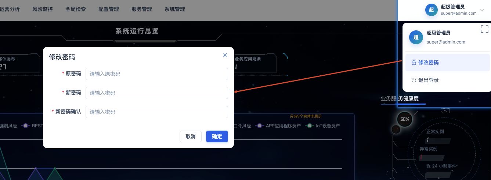

# 登录与账号

## 功能定位

登录与账号功能负责建立用户会话、加载角色菜单，并提供修改密码和安全退出入口。

## 进入方式

访问 ZenVis Web 地址。未登录用户会被重定向到登录页；已登录用户再次访问登录页时会进入默认看板。

## 页面说明

- 登录页左侧展示产品定位，右侧使用账号（默认账号为邮箱格式）、密码和图形验证码登录，并可切换界面语言。
- 登录成功后，前端保存认证信息和当前用户的菜单权限。

- 右上角用户菜单显示当前账号，并提供修改密码、退出登录和全屏切换入口。
- 外部系统可以通过受信任的 Token 链接进入目标页面；Token 和可选盐值会在处理后从地址栏移除。

## 操作前检查

- 确认访问的是管理员提供的正式地址，地址栏使用 HTTPS（本地开发环境除外）。
- 准备个人账号、密码和当前验证码；不要使用他人账号或把密码粘贴到聊天、工单和截图中。
- 首次登录前确认管理员已经把账号绑定到正确角色；菜单权限在登录时加载。

## 核心操作

### 登录系统

1. 输入完整账号，检查是否误带空格。
2. 输入密码和图形验证码；验证码无法辨认或已过期时，先刷新验证码。
3. 点击“登录”，等待系统进入默认看板；不要连续重复点击。
4. 登录后核对右上角账户名称和顶部菜单，确认当前身份与职责一致。

### 修改密码与退出

1. 点击右上角用户图标，选择“修改密码”。
2. 输入旧密码和符合组织安全要求的新密码，提交后按提示重新登录。
3. 使用共享电脑或完成高权限操作后，选择“退出”并确认，确保本地认证信息被清除。

## 结果确认

- 地址栏不再停留在 `/user/login`，且默认看板能够正常加载。
- 顶部菜单与角色权限一致；缺少菜单时不要反复登录，交由管理员核对角色权限。
- 退出后再次访问受保护页面会自动返回登录页。

## 权限与约束

- 系统不提供开放注册，账号由有权限的管理员创建。
- 菜单由角色权限决定，安装插件或新增菜单后还需要为角色分配权限。
- 内置超级管理员拥有全部菜单权限；普通管理员看不到内置超级管理员身份。
- 登录失败或验证码失效时应刷新验证码后重试，不要在文档或日志中记录明文密码。

## 常见问题

### 登录后看不到某个功能

确认角色已分配对应菜单权限，然后退出并重新登录，使菜单权限重新加载。

### Token 链接跳回登录页

检查 Token 是否有效、目标地址是否为允许访问的前端地址，以及代理是否正确转发 `/zenvis/api/`。

## 关联功能

- [用户管理](/01-产品理念与使用/系统管理/用户管理.md)
- [角色管理](/01-产品理念与使用/系统管理/角色管理.md)
- [菜单管理](/01-产品理念与使用/系统管理/菜单管理.md)
