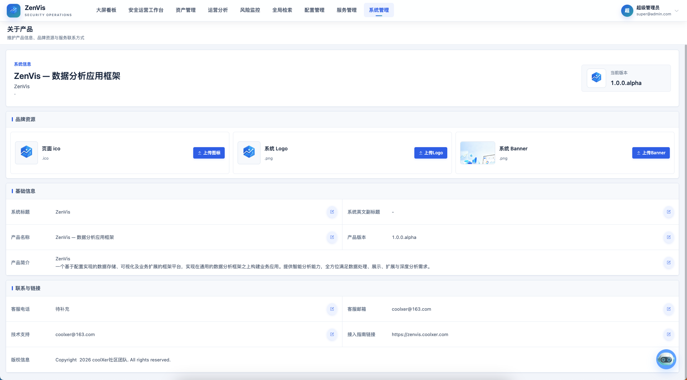

# 关于产品

## 功能定位

关于产品用于查看并维护当前部署实例的品牌与版本信息，包括系统标题、产品名称、简介、联系方式、版权信息和视觉资源。它提供部署实例的统一对外口径。

## 进入方式

使用具备系统管理权限的账号登录，依次进入 **系统管理 → 关于产品**。

## 页面说明

页面以产品信息卡片集中展示系统标题、产品名称、版本、产品简介、客户支持、技术支持、联系与集成信息、版权文字，以及 Logo、横幅和图标等视觉资源。具有权限的管理员可以进入编辑状态更新可配置项。

## 操作前检查

- 准备经过确认的产品名称、简介、公开联系方式和版权文案。
- 图片使用组织批准的 PNG/JPG 资源，并提前检查尺寸、透明背景和文件大小。
- 记录当前版本信息；不要用品牌编辑功能伪造软件版本。

## 核心操作

1. 查看当前实例的产品版本和支持信息，排障或反馈时一并提供。
2. 品牌信息发生变化时，统一更新标题、简介、版权和联系方式。
3. 替换 Logo、横幅或图标后，检查登录页、导航区和关于页面的显示效果。
4. 发布前核对产品名称、版本口径和支持渠道是否与交付约定一致。

## 结果确认

- 保存并刷新后，关于页、登录页和导航区展示统一品牌。
- Logo、横幅和图标清晰，无拉伸、裁切和缓存旧图问题。
- 版本与实际部署一致，公开联系方式可以正常使用。

## 权限与约束

- 所有有权访问该菜单的用户可以查看产品信息，编辑能力仅向管理员开放。
- 视觉资源应符合页面尺寸、文件格式和组织品牌规范。
- 页面中的版本信息用于识别当前部署，不应手工填写与实际软件不一致的版本号。
- 联系方式和支持信息属于公开展示内容，不应写入内部密钥或敏感账号。

## 常见问题

### 修改品牌信息后为什么部分页面没有立即变化？

确认配置已成功保存，并刷新浏览器缓存；如果资源由部署层提供，还需检查静态资源发布是否完成。

### 反馈问题时需要提供哪些信息？

至少提供产品版本、发生时间、操作入口和可复现步骤；如有日志或截图，应先移除密码、Token 等敏感信息。

## 关联功能

- [登录与账号](../登录与账号.md)：登录页会使用实例品牌信息。
- [大屏看板](../大屏看板.md)：看板展示可沿用统一品牌。
- [插件管理](./插件管理.md)：插件版本与平台版本应满足兼容要求。
