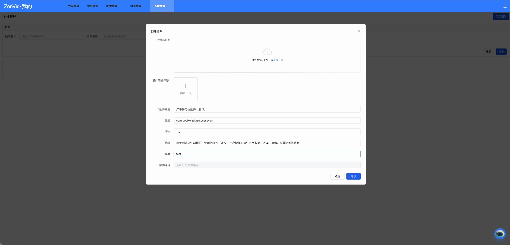
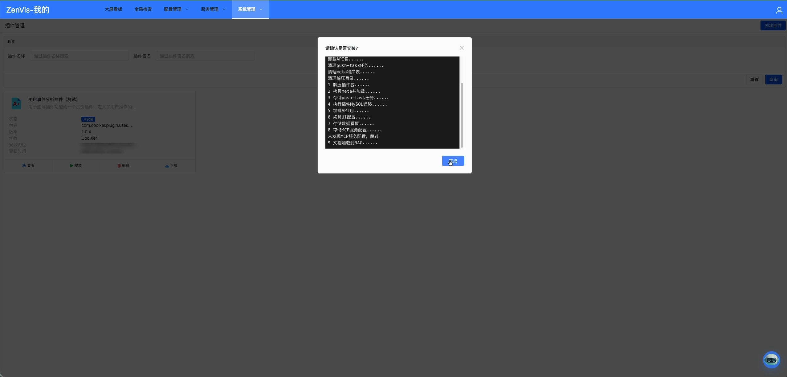
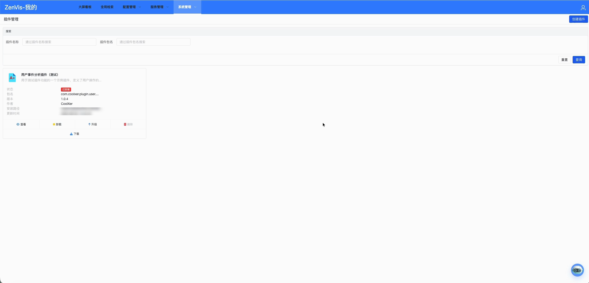
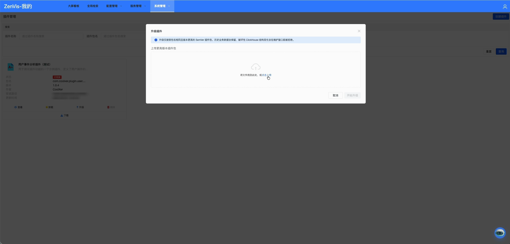

# 插件管理

## 功能定位

插件管理用于查看、安装、升级、恢复、导出和卸载 ZenVis 插件。插件是能力交付单元，可以携带元数据、数据接入服务、业务应用、菜单、页面和配套文档，但插件自己的使用说明由插件包内的 `README` 或 `00_doc` 维护。

## 进入方式

使用具备系统管理权限的账号登录，依次进入 **系统管理 → 插件管理**。

## 页面说明

插件列表用于区分已安装插件、可用插件及其版本状态，并提供上传、创建、安装、升级、导出、恢复、卸载等管理入口。

插件详情集中展示说明文档、组成内容、版本信息和生命周期日志。执行变更前，应先通过详情确认插件来源和影响范围。

## 操作前检查

- 核对插件 ID、来源、签名/校验信息、目标版本、平台兼容范围和依赖。
- 阅读随包 `README`、迁移说明和卸载影响，备份相关配置与业务数据。
- 安排维护窗口并确认没有关键推送任务或页面正在依赖待升级组件。

## 核心操作

1. 查看插件详情和随包文档，确认插件提供的实体、服务、应用及依赖。
2. 点击“创建插件”，上传插件包；检查平台解析出的插件名称、包名、版本、作者和描述，不要仅凭文件名判断。

3. 点击安装并阅读影响提示；在生命周期日志中逐项确认 API、推送任务、Meta、菜单、看板、MCP 与 RAG 文档处理结果。

4. 安装完成后确认卡片状态、版本和安装路径，并验证新菜单、实体、任务及看板。

5. 升级时上传同包名且版本更高的插件包，先阅读服务器与 ClickHouse 结构兼容提示，再开始升级。

6. 导出插件用于交付或备份；发生升级异常时，结合版本与日志评估恢复。
7. 卸载前确认插件页面、任务、表和业务数据已不再使用。

## 结果确认

- 生命周期日志全部成功，详情页显示正确版本和组成内容。
- 插件提供的 Meta、任务、页面、菜单、Skill 和 MCP 能力按声明出现。
- 测试角色授权后可使用业务入口；恢复或卸载后残留内容符合插件声明。

## 权限与约束

- 插件安装、升级、恢复和卸载会改变系统状态，仅授权管理员可以执行。
- 插件代码与配置拥有较高执行权限，只应安装来源可信且经过审核的插件。
- 卸载可能触发插件定义的清理逻辑，并影响关联任务、表或数据；实际行为以插件声明和平台日志为准。
- 本手册只说明内置插件管理页面，不重复维护具体插件的业务操作说明。

## 常见问题

### 插件安装后为什么没有看到新菜单？

检查安装日志是否成功、插件是否声明菜单，以及当前角色是否已获得新菜单权限；必要时重新登录刷新导航。

### 升级失败后应该怎么处理？

先保留现场并查看生命周期日志。确认新版本、依赖和数据兼容性后，再选择修复重试或使用平台提供的恢复能力。

## 关联功能

- [菜单管理](./菜单管理.md)：检查插件交付的菜单入口。
- [角色管理](./角色管理.md)：为用户分配插件菜单权限。
- [元数据配置](../配置管理/元数据配置.md)：查看插件交付的实体配置。
- [数据推送服务](../服务管理/数据推送服务.md)：查看插件交付的数据任务。
