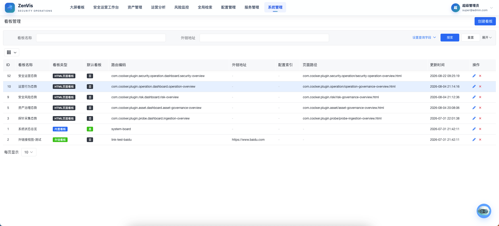
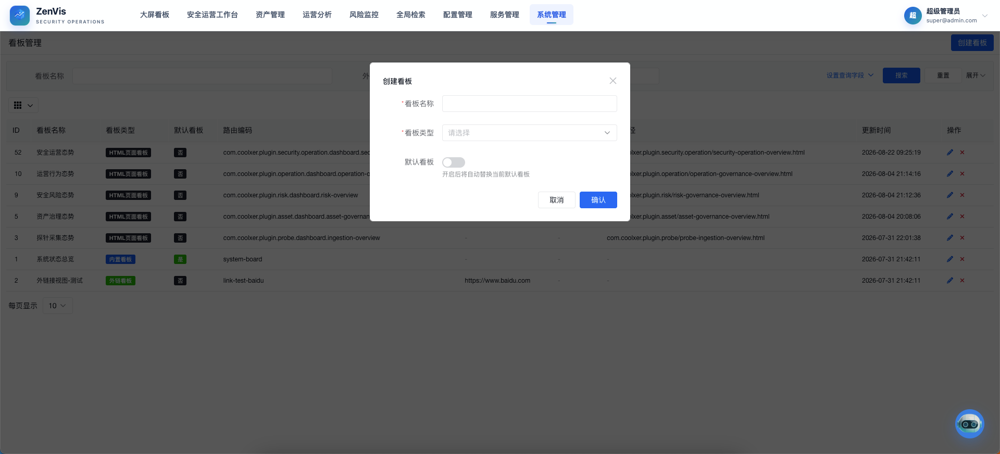

# 看板管理

## 功能定位

看板管理用于登记平台可展示的大屏看板，统一维护看板名称、类型、内容来源和默认看板。它负责“配置哪些看板”，大屏看板页面负责“查看和切换看板”。

## 进入方式

使用具备系统管理权限的账号登录，依次进入 **系统管理 → 看板管理**。

## 页面说明

列表展示看板名称、类型、配置来源及默认状态。当前看板可来自内置页面、低代码页面、静态 HTML 页面或外部链接，不同类型需要填写的配置项不同。

## 操作前检查

- 根据来源确定看板类型，并准备内置编码、配置索引、HTML 相对路径或 HTTPS URL。
- 先直接验证目标页面可访问，再登记为看板。
- 修改默认看板前确认其适合所有拥有大屏入口的用户。

## 核心操作

1. 点击“创建看板”，先选择内容类型，再填写该类型所需的页面编码、配置索引、HTML 路径或 URL；HTML 页面路径只填写相对路径。

2. 编辑已有看板的名称和内容来源，保存后到大屏看板验证加载效果。
3. 将常用看板设置为默认看板，使用户进入大屏时优先看到该内容。

4. 对不再使用的自定义看板先确认无菜单、业务流程或演示场景依赖，再执行清理。

## 结果确认

- 列表中的类型、来源和默认标记正确，系统仅有一个默认项。
- 在大屏看板中可选择并完整加载，刷新页面后仍保持目标内容。
- 指定 `id` 的分享链接在新会话中能打开同一看板。

## 权限与约束

- 看板配置属于系统级管理能力，仅授权管理员可维护。
- 外部链接和 HTML 页面应来自可信来源，并满足当前部署环境的访问与安全策略。
- 同一时间只应有一个生效的默认看板。
- 本页不负责编辑外部系统或低代码页面本身的内容。

## 常见问题

### 看板保存后为什么无法正常显示？

检查看板类型与配置字段是否匹配，并确认目标页面、静态文件或 URL 在当前部署环境中可以访问。

### 默认看板与大屏页面中的手动选择有什么关系？

默认看板决定首次进入时的优先展示；用户仍可在大屏看板页面切换到其他已配置看板。

## 关联功能

- [大屏看板](../大屏看板.md)：查看与切换已配置看板。
- [静态页面配置](../配置管理/静态页面配置.md)：维护可被看板引用的静态页面。
- [菜单管理](./菜单管理.md)：配置看板相关入口。
