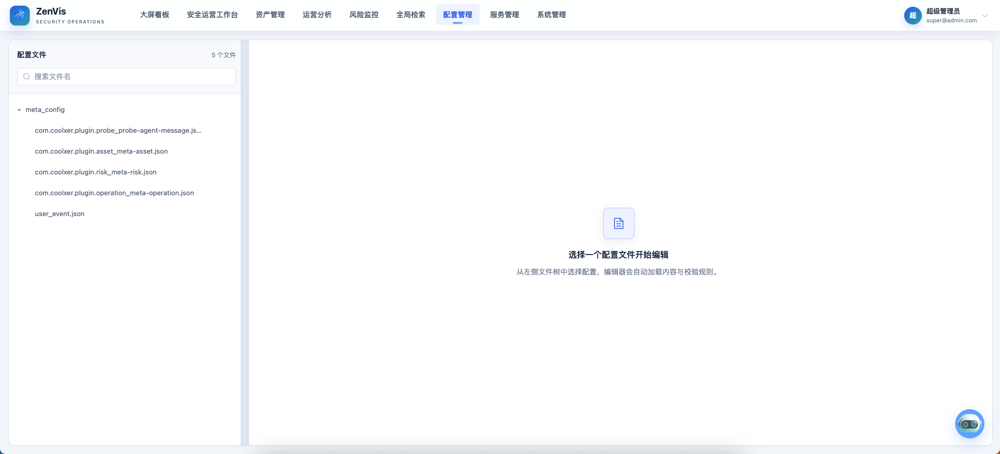
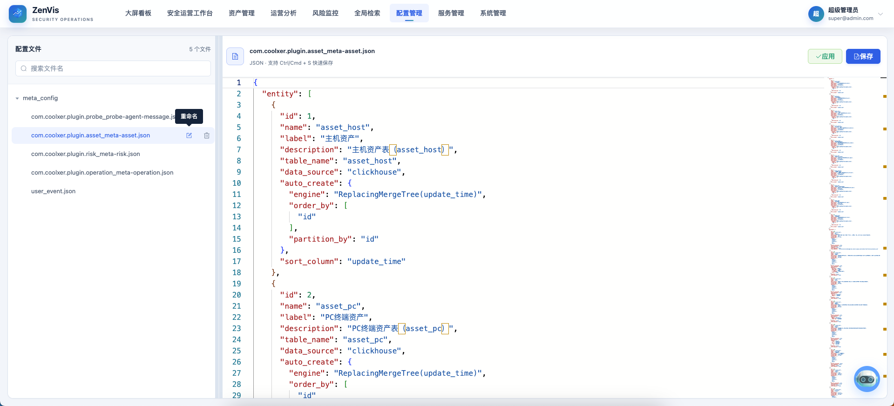
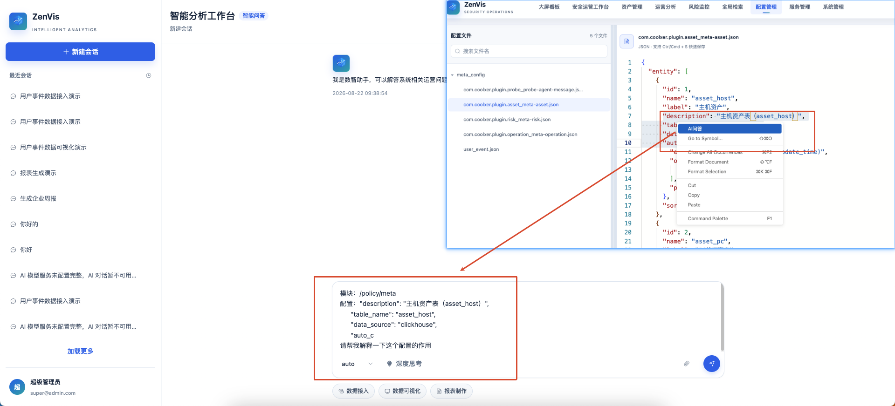

# 元数据配置

## 功能定位

元数据配置维护实体、属性和操作符，是统一检索、统计、数据写入和可视化使用的数据语义基础。

## 进入方式

在顶部导航打开 **配置管理 → 元数据配置**。左侧为配置列表，右侧为编辑器和操作工具栏。

## 页面说明

Meta 顶层通常包含：

| 区域 | 用途 |
| --- | --- |
| `entity` | 定义实体名称、标签、表、数据源、排序和自动建表行为。 |
| `attribute` | 定义字段、列、类型、显示、操作符、候选值、复制和跳转。 |
| `operator` | 定义可用于普通检索的比较方式。 |

编辑器支持读取、修改、保存、应用、新增、重命名和删除配置，并通过 JSON Schema 提供校验、补全和字段说明。

## 操作前检查

- 导出或复制当前文件内容，记录关联的推送任务、过滤器、图表和页面。
- 新增字段时确认物理列、类型、空值、候选值和默认操作符；变更已有字段时先评估数据迁移。
- 生产环境变更应安排验证窗口，并准备回退到上一份可用配置。

## 核心操作

1. 在左侧配置列表选择已有 Meta 文件；需要新建时使用新增入口并填写不重复的 `.json` 文件名。
2. 在编辑器中补充实体、属性、物理列、查询操作符、展示规则和自动建表参数。

3. 根据 Schema 提示修复格式和字段问题。
4. 保存文件。
5. 点击应用，使运行时元数据重新加载。
6. 在全局检索中验证实体、字段和操作符。
7. 需要解释或辅助修改时，选中配置片段发送给 AI 问答；采纳结果前仍需人工审查和 Schema 校验。

## 结果确认

- 编辑器没有 Schema 错误，保存与应用均返回成功。
- 全局检索可以选择实体、字段和预期操作符，并能查到样例数据。
- 推送任务日志没有新增列缺失、类型转换或表结构不一致错误。

## 权限与约束

- 实体名、属性名、物理列和 ClickHouse 表结构必须保持一致。
- 删除或重命名字段会影响过滤器、推送任务、页面和统计配置。
- 保存只写入文件；应用才会更新运行时元数据。
- 自动建表适合新增实体，不替代复杂的数据迁移。
- AI 补全只能作为编辑辅助，结果仍需通过 Schema 和业务审查。

## 常见问题

### 保存成功但全局检索没有变化

确认已执行“应用”，并检查应用返回的校验错误。

### 属性存在但查询报列不存在

检查 `column_name`、数据类型和 ClickHouse 实际表结构。

## 关联功能

- [全局检索](/01-产品理念与使用/全局检索.md)
- [数据推送服务](/01-产品理念与使用/服务管理/数据推送服务.md)
- [Meta 与数据建模](/03-插件开发与集成/Meta与数据建模.md)
