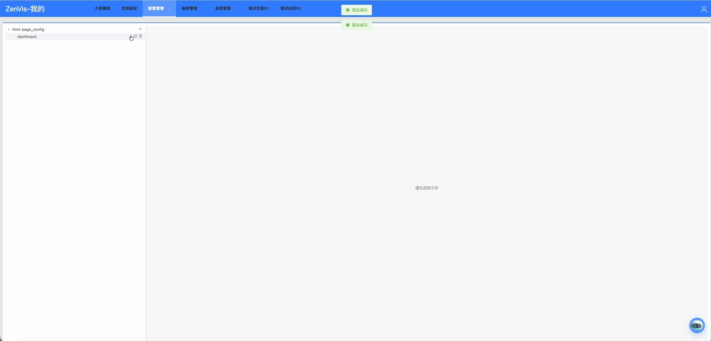
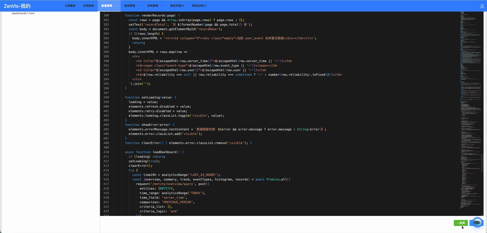

# 静态页面配置

## 功能定位

静态页面配置维护平台或插件使用的 HTML 页面定义，为专题页面、HTML 看板和菜单入口提供可部署内容。

## 进入方式

在顶部导航打开“配置管理”，选择“静态页面配置”。页面沿用配置树和编辑器布局。

## 页面说明

- 左侧显示可用页面配置文件。
- 右侧读取和编辑当前文件。
- 工具栏提供保存、应用、新增、重命名和删除。
- 页面可以由平台直接维护，也可以由插件安装过程交付。

## 操作前检查

- 确认页面归属平台还是插件；插件页面应优先回到插件源码修改。
- 列出 HTML、脚本、样式、图片和接口依赖，确认目标环境均可访问。
- 修改线上页面前保留当前文件，并在测试入口验证脚本安全策略和浏览器兼容性。

## 核心操作

1. 在 `html-page_config` 下选择现有目录，或点击“+”创建页面目录；目录名应与后续配置的页面路径保持一致。

2. 新建或选择 `.html` 文件，在编辑器中完成 HTML、样式、脚本和接口调用配置。
3. 保存后点击“应用”，等待页面提示成功，再从最终入口验证。

4. 在菜单或看板中配置对应页面路径。
5. 从最终入口检查资源加载和页面尺寸。

## 结果确认

- 保存和应用成功，最终入口刷新后加载的是新版本。
- 浏览器控制台没有 404、跨域、混合内容或脚本异常。
- 常用分辨率下没有横向溢出、遮挡或不可操作控件。

## 权限与约束

- 页面路径使用相对路径，不应写入本机绝对路径。
- 不要在 HTML 中嵌入密码、Token 或模型密钥。
- 页面引用的静态资源必须能从目标部署环境访问。
- 插件提供的页面优先在插件源码中维护，避免平台侧修改在升级时丢失。

## 常见问题

### 页面入口显示空白

检查配置是否已应用、页面路径是否正确，以及浏览器控制台是否有资源或脚本错误。

### 本地可以打开，部署后资源丢失

将资源路径改为部署可访问的相对路径，并检查前端 `/zenvis` 基础路径。

## 关联功能

- [大屏看板](/01-产品理念与使用/大屏看板.md)
- [看板管理](/01-产品理念与使用/系统管理/看板管理.md)
- [菜单管理](/01-产品理念与使用/系统管理/菜单管理.md)
