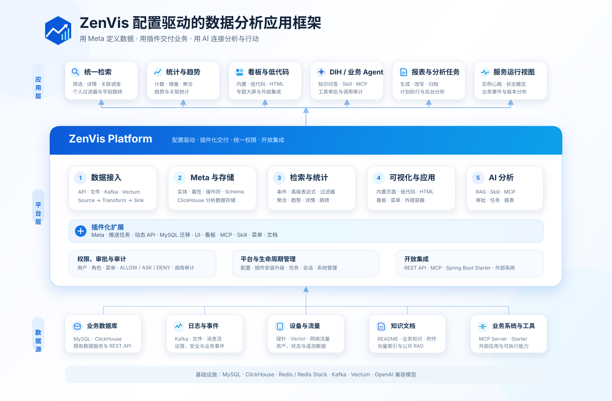

# ZenVis数据分析应用框架

> **产品定位：面向企业数据分析场景的配置化应用框架**
>
> - 通过 Meta 配置定义实体、属性、检索方式和存储规则，降低数据模型变化带来的开发成本。
> - 将数据接入、统一检索、统计分析、可视化、权限和系统管理沉淀为可复用的平台能力。
> - 通过插件扩展数据模型、推送任务、动态 API、低代码页面、HTML 看板、MCP、Skill 和菜单。
> - 通过数智中心（DIH）提供知识问答、业务 Agent、工具审批、后台分析任务和报表制作能力。
> - 项目采用 Apache License 2.0 开源，适合团队按实际业务持续扩展。

> **为什么做它：**
>
> 企业在建设资产管理、运营分析、安全监测和业务数据应用时，常常遇到相似的问题：
>
> - 数据模型硬编码，字段或业务口径变化后需要重复修改接口、页面和数据库结构。
> - 多个系统各自建设采集、查询、分页、权限和看板，形成数据孤岛并造成重复投入。
> - 数据接入、检索、可视化与业务应用之间耦合较深，难以复用已有能力快速交付新场景。
> - AI 能力与业务数据、工具权限和操作审计脱节，难以安全地进入真实业务流程。

> ZenVis 将这些重复能力抽象成统一平台，让团队把精力集中在业务数据定义、分析方法和应用体验上，而不是反复搭建基础设施。

> **做这个产品的思路是什么：**
>
> ZenVis 将数据应用归纳为一条可以配置和扩展的主链路：
>
> `数据接入 → 元数据与存储 → 检索与统计 → 可视化与应用 → AI 分析与处置`
>
> 平台以 Meta 作为数据语义基础，通过 Kafka 与 Vectum 组织数据接入，使用 ClickHouse 承载分析型实体数据，并提供统一的检索、统计、趋势和详情接口。前端通过内置页面、低代码应用、HTML 看板和外链承载不同形态的业务应用。
>
> 具体业务能力优先通过插件交付，使数据模型、接入任务、API、页面、看板、AI 工具与使用文档可以作为一个独立能力包安装和升级。DIH 在此基础上通过 RAG、Skill、MCP scope、`ALLOW / ASK / DENY` 策略与审计机制，把自然语言分析连接到受控的业务工具。

> **适合哪些场景：**
>
> - **多源数据统一检索：** 汇聚资产、设备、日志、网络流量、风险或业务事件，按统一实体和字段进行筛选、统计与关联调查。
> - **运营与风险分析：** 构建指标趋势、状态监测、异常发现、风险研判和专题分析应用。
> - **低代码应用与可视化：** 基于配置快速交付管理页面、专题看板、静态 HTML 大屏或既有系统集成入口。
> - **插件化行业扩展：** 将特定行业的数据模型、接入链路、API、UI、MCP 和 Skill 打包为可安装插件。
> - **AI 辅助分析：** 通过自然语言完成知识问答、数据查询、工具审批、后台分析和结构化报表制作。
> - **业务服务可观测：** 通过 Starter 或公开 API 汇聚外部业务应用的实例心跳和重要事件。

> **不适合做什么：**
>
> - **不适合作为全功能 ERP 或交易系统：** ZenVis 侧重分析、监测和数据应用，不直接替代财务、供应链、订单等复杂交易系统。
> - **不适合高精度实时控制：** 平台的数据接入、分析和审批链路不用于毫秒级闭环控制、工业联锁或其他安全关键控制场景。
> - **不适合完全无约束的数据操作：** 高级检索不接受任意 SQL，AI 工具也必须遵循权限范围、审批策略和调用审计。
> - **不适合脱离业务建模直接使用：** 平台提供通用框架，实体含义、字段规则、接入方式和分析口径仍需要通过 Meta、推送任务和插件明确配置。

*一张图理解 ZenVis：通过 Meta 配置和插件扩展，将多源数据转化为检索、统计、可视化与受控 AI 分析能力。点击图片可查看高清大图。*
